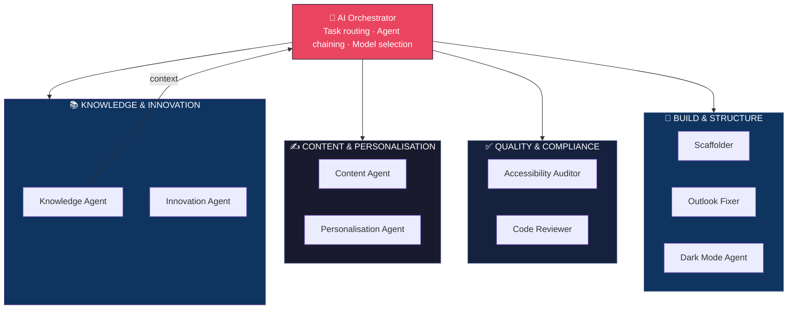
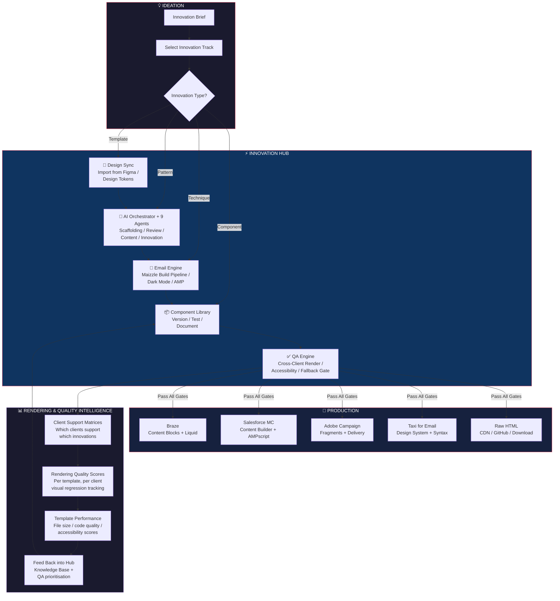
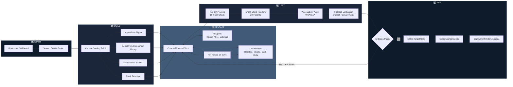
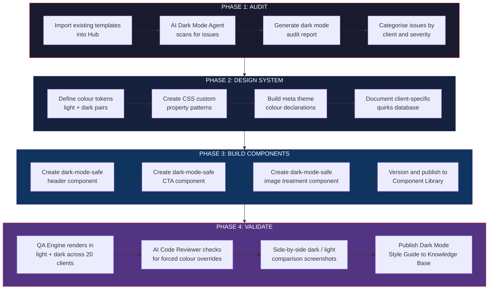
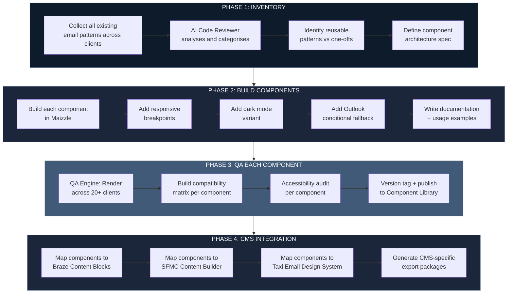
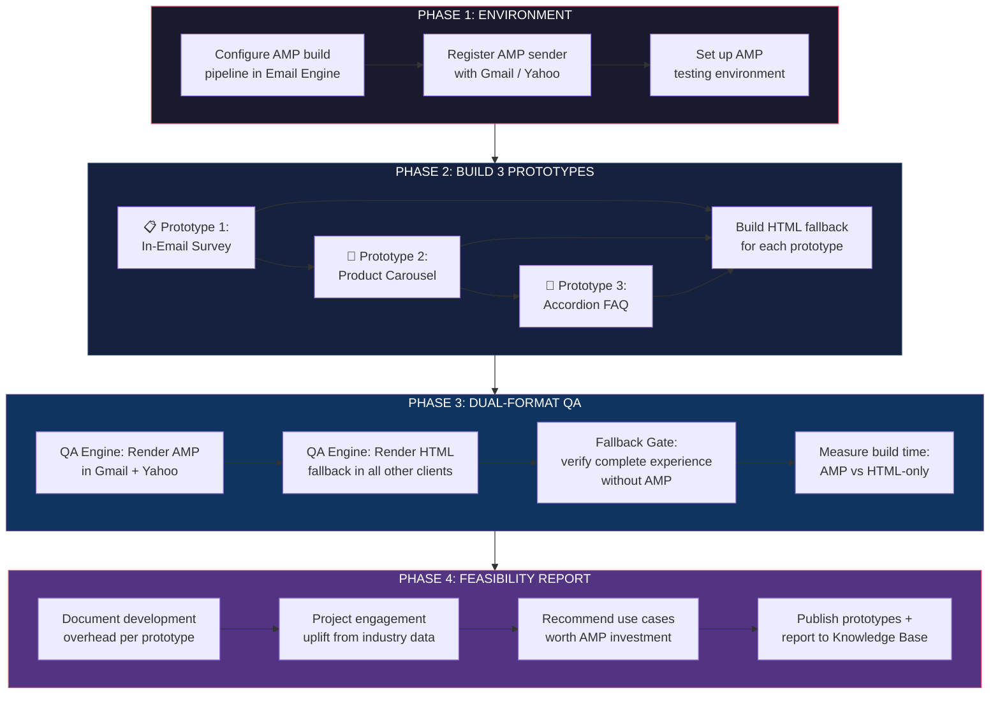
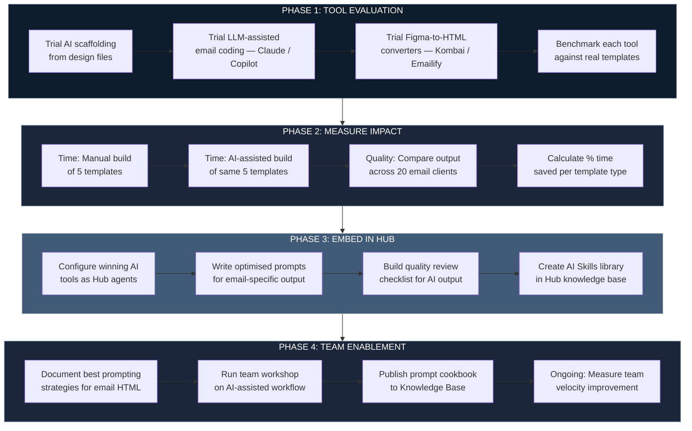
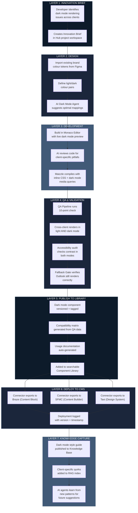
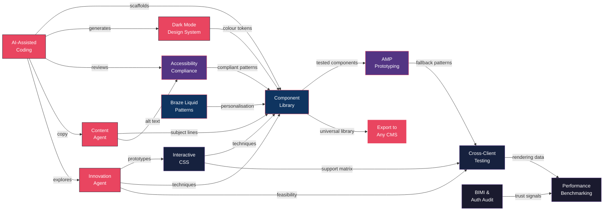

# MERKLE — HTML Email Innovation Hub

## Strategic Architecture & Implementation Plan

**Version 1.1 | March 2026**
**Classification: Internal / Confidential**
Built on a production-ready full-stack architecture (FastAPI + Next.js)

---

# 1. Executive Summary

This document defines the complete architecture and implementation plan for the Merkle HTML Email Innovation Hub — a self-hosted, CMS-agnostic platform that centralises email innovation, prototyping, AI-assisted development, design tool integration, and cross-client QA into a single unified workflow. The Hub is designed to operate independently on Merkle infrastructure while connecting seamlessly to any client tech stack including Braze, Salesforce Marketing Cloud, Adobe Campaign, and Taxi for Email.

The Innovation Hub addresses a challenge specific to how Merkle operates: we serve clients across diverse martech ecosystems — Braze, Salesforce, Adobe, Taxi — yet the email development process remains fragmented, manual, and siloed between engagements. No off-the-shelf tool is designed for this multi-client, multi-platform agency model. By building a centralised innovation engine with an agnostic connector architecture, we create compound value — every innovation, component, and pattern built for one client becomes available to all.

## 1.1 Strategic Objectives

- **100% Merkle-Owned IP:** The Hub is built entirely on open-source technologies with no SaaS platform dependencies. Every line of code, every component, every AI skill definition is Merkle intellectual property — a growing strategic asset, not a rented service.
- **Centralise Innovation:** Single platform for HTML email R&D, prototyping, and production across all Merkle clients.
- **CMS-Agnostic Pipeline:** Modular connector architecture supporting Braze, Salesforce MC, Adobe Campaign, Taxi for Email, and future platforms.
- **AI-Powered Development:** Integrated AI coding assistant with sub-agents for scaffolding, QA, accessibility, dark mode, and cross-client compatibility. Local-first model strategy minimises API costs.
- **Cost-Optimised Operations:** Local LLMs handle 70–90% of AI tasks at zero API cost. Entire stack runs on open-source software with zero licence fees. Self-hosted infrastructure eliminates per-seat SaaS pricing.
- **Design-to-Code Bridge:** Native Figma integration via API and plugin ecosystem (Emailify, Email Love) for frictionless design handoff.
- **GDPR-First Security:** Zero PII in the Hub. All data flows anonymised. API design follows privacy-by-design principles.
- **Fallback-First QA:** Every innovation ships with a bulletproof HTML fallback. Automated rendering checks before any code leaves the system.

## 1.2 Technology Foundation

The Hub is built entirely on open-source technologies — zero licence fees, zero per-seat pricing, zero vendor lock-in. Merkle owns every component of the stack:

- **Backend:** FastAPI + async SQLAlchemy + PostgreSQL + Redis — all open-source, production-grade, high-performance async API layer
- **Frontend:** Next.js 16 + React 19 + Tailwind CSS + shadcn/ui — open-source component architecture (shadcn/ui is copy-paste, not a library dependency)
- **Auth:** JWT with RBAC, brute-force protection, token revocation — built in-house, no Auth0/Okta dependency
- **AI Layer:** Local-first with Ollama/vLLM (zero API cost for 70–90% of tasks) + Protocol-based cloud LLM integration for frontier reasoning. RAG pipeline with pgvector (open-source vector search, no Pinecone/Weaviate fees)
- **Infrastructure:** Docker Compose, nginx reverse proxy, Alembic migrations — self-hosted on Merkle servers, no AWS/Azure managed service fees
- **Email Frameworks:** Maizzle (open-source, Tailwind-native email framework) as primary build engine, with MJML (open-source) support for legacy compatibility
- **Total software licence cost: £0.** The only recurring costs are infrastructure (servers, GPU for local LLMs) and optional cloud AI API usage for frontier tasks.

---

# 2. System Architecture

## 2.1 High-Level Architecture

The Innovation Hub follows a Vertical Slice Architecture where each feature owns its full stack. The system is composed of five core layers:

| Layer | Components | Purpose |
|-------|-----------|---------|
| **Presentation** | Next.js 16 + React 19 + Tailwind + shadcn/ui | Hub UI: project workspace, code editor, live preview, AI chat, QA dashboard |
| **API Gateway** | FastAPI + async endpoints + WebSocket | RESTful + real-time API layer, RBAC, rate limiting, GDPR compliance |
| **Core Services** | Email Engine, AI Orchestrator, Design Sync, QA Engine, Connector Pipeline | Business logic: build, test, validate, export email HTML |
| **Data Layer** | PostgreSQL + pgvector + Redis | Projects, components, templates, AI embeddings, cache, sessions |
| **Integration Layer** | CMS Connectors, Figma API, Litmus/EoA API, GitHub | Bidirectional sync with external tools and client platforms |

## 2.2 Vertical Slice Structure

Following the Vertical Slice pattern, each feature module is self-contained:

| File | Responsibility |
|------|---------------|
| `app/{feature}/models.py` | SQLAlchemy models for the feature domain |
| `app/{feature}/schemas.py` | Pydantic request/response schemas (input validation, serialisation) |
| `app/{feature}/repository.py` | Database operations (queries, CRUD) |
| `app/{feature}/service.py` | Business logic, orchestration, external API calls |
| `app/{feature}/routes.py` | FastAPI endpoints (HTTP + WebSocket) |
| `app/{feature}/exceptions.py` | Feature-specific error types |
| `app/{feature}/tests/` | Unit and integration tests |

## 2.3 Core Feature Modules

| Module | Description | Key Endpoints |
|--------|------------|---------------|
| **email_engine** | Maizzle/MJML build pipeline, HTML compilation, inline CSS, responsive transforms, dark mode injection | `POST /build`, `POST /preview`, `POST /validate` |
| **ai_assistant** | AI orchestrator with sub-agents: scaffolding, code review, accessibility audit, Outlook fix, dark mode, personalisation logic | `POST /chat`, `POST /generate`, `WS /stream` |
| **design_sync** | Figma API integration, design token extraction, component mapping, image asset pipeline | `POST /import`, `GET /tokens`, `POST /sync` |
| **qa_engine** | Cross-client rendering tests (Litmus/EoA API), HTML validation, accessibility checker, fallback verification | `POST /test`, `GET /results`, `POST /validate` |
| **connector_pipeline** | CMS-agnostic export: Braze Content Blocks, SFMC Content Builder, Adobe, Taxi for Email, raw HTML | `POST /export/{platform}`, `GET /status` |
| **component_library** | Versioned, tested email components with compatibility matrices, dark mode variants, and usage docs | `CRUD /components`, `POST /test` |
| **projects** | Workspace management, client configurations, template versioning, collaboration | `CRUD /projects` |
| **knowledge** | RAG pipeline: email dev best practices, client quirks database, community updates (pgvector) | `POST /search`, `POST /ingest` |

## 2.4 Multi-Tenancy & Data Isolation

The Hub enforces strict client-level data isolation from day one — a requirement unique to the agency model, where multiple competing brands may be served simultaneously. This is an architectural decision, not a post-launch addition.

| Principle | Implementation |
|-----------|---------------|
| **Client A cannot see Client B's work** | Every project is scoped to a client. RBAC enforces visibility — developers are assigned to client workspaces during briefing/discovery. No cross-client data leakage. |
| **Shared component library, private customisations** | The global component library (Merkle-owned patterns, tested modules) is available to all projects. Client-specific customisations (branded variants, custom templates) are private to that client's workspace. |
| **Project scoping during briefing** | Client workspace permissions are configured during the briefing and discovery phase. Project leads assign team members, set brand guardrails, and configure which connectors are active. |
| **Database-level isolation** | Client data is partitioned by `client_id` foreign key across all tables. Row-level security in PostgreSQL enforces isolation at the database layer — even a bug in the application layer cannot leak data across clients. |
| **Component inheritance model** | Global library → Client library → Project templates. Components cascade downward. A global update propagates to all clients. A client-specific override stays private. |

---

# 3. CMS-Agnostic Connector Pipeline

The connector pipeline is the system that makes the Hub truly platform-agnostic. It decouples email creation from email delivery, allowing teams to build once and deploy anywhere.

## 3.1 Connector Architecture

Each connector implements a common interface (Python Protocol) with platform-specific adapters:

| Platform | Export Format | API Method | Auth |
|----------|-------------|-----------|------|
| **Braze** | Content Blocks + Liquid templates + campaign HTML | Braze REST API v2 | Bearer token (API key) |
| **Salesforce MC** | Content Builder assets + AMPscript templates | SFMC REST API + SOAP (legacy) | OAuth 2.0 server-to-server |
| **Adobe Campaign** | Email deliveries + content fragments | Adobe Campaign Standard API | Adobe IMS OAuth |
| **Taxi for Email** | Taxi Syntax-wrapped HTML + Email Design Systems | Taxi API / manual export (HTML zip) | API key + workspace auth |
| **Raw HTML** | Production-ready HTML, inlined CSS, images CDN-hosted | File download / GitHub push | N/A / GitHub token |

## 3.2 Existing OTT Streaming Client as Reference Architecture

A recent Merkle engagement for a major European OTT streaming platform provides a proven reference for how the connector pipeline should work. Key patterns to adopt:

- **mParticle → Braze data flow:** The SDH Events feed pattern (server-to-server event forwarding with attribute filtering) demonstrates how to selectively push data downstream without exposing full user profiles.
- **Connected Content pattern:** The client's content catalogue API integration in Braze (with 15-minute caching and territory-based cache keys) is an exemplary pattern for real-time content personalisation that the Hub should support as a template.
- **Liquid template architecture:** The catalog-driven content block pattern shows sophisticated localised personalisation with fallback logic — exactly the kind of pattern the Hub's component library should include.
- **Currents data pipeline:** The Braze → mParticle → GCS → BigQuery flow for engagement data is a model for how the Hub should track email performance across platforms.

## 3.3 Taxi for Email Integration

Taxi for Email is a key tool in the Merkle ecosystem. The Hub integrates with Taxi at two levels:

- **Taxi Syntax injection:** The Hub can wrap its compiled HTML in Taxi Syntax tags to make components editable within the Taxi CMS. This allows the Hub to produce Email Design Systems that non-developers can assemble in Taxi.
- **Bidirectional sync:** Templates built in the Hub can be pushed to Taxi, and Taxi templates can be imported into the Hub for innovation and enhancement before being pushed back.

---

# 4. Design Tool Integration

The design-to-code bridge is one of the highest-value capabilities of the Hub. The goal is zero-loss translation from design intent to production HTML email.

## 4.1 Figma Integration Strategy

Figma is the primary design tool. Integration operates at three levels:

### 4.1.1 Figma REST API (Direct)

The Hub connects to the Figma REST API to pull design data programmatically. This enables automated token extraction, component mapping, and change detection.

- **Design token sync:** Colours, typography, spacing values extracted from Figma Styles and Variables, mapped to the Hub's email-safe token system (hex colours, px units, system font stacks).
- **Component structure:** Figma component sets are mapped to email module definitions. Auto-detection of headers, CTAs, product cards, footers based on naming conventions.
- **Change webhooks:** Figma file change events trigger re-sync, keeping the Hub's design tokens current with the latest design updates.

### 4.1.2 Plugin Ecosystem

The Hub leverages existing Figma plugins for design-to-email conversion:

| Plugin | Capability | Integration Path |
|--------|-----------|-----------------|
| **Emailify** | Full Figma-to-HTML conversion, responsive, cross-client tested, exports to 30+ ESPs | Direct export to Hub via webhook or import HTML output for refinement |
| **Email Love** | MJML-based conversion, component library, accessibility built-in, enterprise integrations | Import MJML output into Hub's build pipeline for further processing |
| **MigmaAI** | AI-powered design analysis, 95%+ fidelity, auto-responsive | API integration for automated batch conversion |

### 4.1.3 Design Framework Pipeline

The complete design-to-production flow:

1. Designer creates email layout in Figma using brand component library
2. Figma API extracts design tokens + structure (or plugin exports HTML/MJML)
3. Hub's design_sync module maps Figma layers to email component definitions
4. AI assistant reviews mapping, suggests optimisations for email constraints (Outlook, dark mode)
5. Maizzle build pipeline compiles to production HTML with Tailwind utilities inlined
6. QA engine runs cross-client tests (Litmus/Email on Acid API)
7. Approved HTML exported to target CMS via connector pipeline

---

# 5. AI-Powered Development Assistant

The AI assistant is not a chatbot — it is an orchestration layer with specialised sub-agents, each optimised for a specific aspect of email development. The developer is always in control: every agent can be individually enabled or disabled depending on the task, and the AI Orchestrator itself is optional — developers can invoke any sub-agent directly or let the Orchestrator route and chain tasks automatically. The developer can oversee every aspect of the development process, review all AI outputs before they are applied, and manually intervene or take over at any point.

## 5.1 Agent Architecture

| Agent | Capability | Triggered By |
|-------|-----------|-------------|
| **AI Orchestrator** *(optional)* | When enabled, routes tasks to the right sub-agent based on complexity. Chains agents for multi-step workflows (e.g. Scaffolder → Dark Mode → Accessibility → Code Review). Manages model routing between local LLMs (70–90%) and cloud APIs (10–30%). Developers can bypass the Orchestrator and invoke any agent directly. | Enabled by the developer per task — or bypassed for direct agent access |
| **Scaffolder** | Generates email HTML structure from design specs or text prompts. Outputs Maizzle templates with Tailwind classes, MSO conditionals, responsive stacking. | New project, design import, user prompt |
| **Outlook Fixer** | Analyses HTML and inserts Outlook-specific conditional comments, VML backgrounds, table-based fallbacks for the Word rendering engine. | Build pipeline, manual trigger, QA failure |
| **Dark Mode Agent** | Injects `@media (prefers-color-scheme: dark)` rules, `[data-ogsc]`/`[data-ogsb]` selectors, transparent PNG suggestions, colour token remapping. | Build pipeline, design token change |
| **Accessibility Auditor** | Runs WCAG AA checks: contrast ratios, semantic structure, alt text, touch targets (44x44px min), lang attributes, screen reader simulation. Generates AI alt text for images using vision model analysis. | QA pipeline, pre-export check |
| **Content Agent** | Generates and refines email marketing copy: subject lines, preheaders, CTA text, body copy. Supports rewrite, shorten, expand, and tone adjustment. Brand voice constraints applied per client. | Editor context menu, user prompt, template refinement |
| **Personalisation Agent** | Generates Liquid (Braze), AMPscript (SFMC), or platform-specific dynamic content logic from natural language requirements. | User prompt, template configuration |
| **Code Reviewer** | Static analysis of email HTML: redundant code, invalid nesting, unsupported CSS properties per client, file size optimisation. | Pre-build, pre-export gate |
| **Knowledge Agent** | RAG-powered answers from email dev knowledge base: client quirks, CSS support tables, community best practices, rendering engine updates. | User question, diagnostic context |
| **Innovation Agent** | Explores and prototypes new email techniques — AMP carousels, interactive CSS, kinetic elements, CSS animations. Cross-references rendering intelligence data to assess feasibility for a client's specific audience. Generates automatic fallback strategies and produces capability reports showing what works where. | Innovation R&D sessions, client pitch preparation, new technique evaluation |

### Four Disciplines Applied to Each Agent

Each agent operates within a cumulative four-discipline framework. Higher-layer capabilities build on the foundations below:

1. **Prompt Craft** — "What should I say?" — Table stakes: output formats, guardrails, anti-patterns, counter-examples.
2. **Context Engineering** — "What does it need to know?" — Memory systems, RAG pipelines, project conventions, Can I Email data loaded at runtime.
3. **Intent Engineering** — "What should the AI want?" — Trade-off hierarchies, decision boundaries, brand priorities, risk thresholds per client.
4. **Specification Engineering** — "What does done look like?" — Self-contained problem statements, acceptance criteria, constraint architecture, decomposition into <2hr subtasks, evaluation design.

| Agent | Prompt Craft | Context Engineering | Intent Engineering | Specification Engineering |
|-------|-------------|--------------------|--------------------|--------------------------|
| **Orchestrator** | — | — | — | Decomposes briefs into <2hr executable subtasks |
| **Scaffolder** | Standardised SKILL.md with output format | Project conventions + brand CSS loaded at runtime | Layout vs performance trade-offs per client | Self-contained specs: agent never fetches extra context mid-run |
| **Outlook Fixer** | Counter-examples ("don't use div where table required") | Can I Email data + learned client quirks auto-loaded | — | Must-Nots: never modify master reset styles |
| **Dark Mode Agent** | Best-performing prompt variants tracked | Brand colour tokens + client dark mode preferences | Never modify brand-reserved hex codes | Acceptance criteria: what constitutes correct dark mode CSS |
| **Accessibility Auditor** | Explicit check output formats | WCAG AA reference tables + past audit results | Risk threshold: block vs warn per severity | 3–5 test cases with known-good outputs per check |
| **Content Agent** | Brand voice examples + anti-patterns | Client tone guides + previous campaign copy | Priority: brand voice > character count | — |
| **Personalisation Agent** | Liquid/AMPscript syntax templates | ESP platform docs + Connected Content patterns | — | Escalation triggers for complex nested logic |
| **Code Reviewer** | Code quality scoring rubric | Client CSS support matrix + Gmail 102KB threshold | — | Pre-defined quality gates with measurable pass/fail |
| **Knowledge Agent** | — | Auto-hydrates with project files + client conventions | — | — |
| **Innovation Agent** | — | Rendering intelligence data + feasibility databases | Fallback reliability > visual complexity | Capability reports with quantified audience coverage |

## 5.2 Agent Hierarchy

The Orchestrator is an optional coordination layer — when enabled, it analyses the request, selects the appropriate sub-agent(s), and chains them for multi-step workflows. Developers can also invoke any agent directly, bypassing the Orchestrator entirely. The developer oversees all AI output and can manually intervene at any stage.



## 5.3 Agent Orchestration via UI

The Hub UI provides a unified orchestration panel where developers remain in full control:

- **Enable / disable any agent** per task — use only the agents relevant to the current job
- **Deploy the Orchestrator optionally** — let it route and chain agents automatically, or bypass it and invoke agents directly
- Provide detailed natural-language briefs that get decomposed into agent-specific instructions
- **Review all agent outputs** individually before merging into the main template — nothing is applied without developer approval
- **Manually intervene** at any point — edit AI-generated code, override suggestions, or take over entirely
- Configure agent behaviour per project (e.g., disable AMP agent for Outlook-heavy audiences)
- Chain agents in custom workflows (e.g., Scaffolder → Outlook Fixer → Dark Mode → Accessibility Audit → Code Review)

## 5.4 AI Skills System

Each agent has a SKILL.md file defining its expertise, constraints, and output format. Skills are versioned and can be updated independently:

- Skills are stored in the Hub's knowledge base and loaded into the AI context at runtime
- New skills can be authored by senior developers and deployed without code changes
- Skill performance is benchmarked using eval suites specific to email HTML quality

### SKILL.md Structure — Four Discipline Sections

Each SKILL.md is organised around the four disciplines, ensuring agents have complete operating context:

**1. Prompt Craft** — The agent's instruction layer:
- Best-performing system prompts (curated with success metrics)
- Failure examples and counter-examples ("don't do X because Y")
- Output format specifications (HTML structure, markdown, JSON schema)
- Anti-patterns specific to this agent's domain

**2. Context Engineering** — Required context checklist:
- Data sources that must be loaded before invocation (Can I Email, client brand guides, component library)
- Project conventions auto-injected at runtime
- RAG knowledge base queries that improve output quality
- Memory entries from previous sessions relevant to this task type

**3. Intent Engineering** — Decision framework:
- Trade-off hierarchies per client (e.g., accessibility > file size)
- Decision boundaries for autonomous action vs escalation
- Brand priority rules that override default optimisation
- Risk threshold definitions (block vs warn vs ignore)

**4. Specification Engineering** — Definition of "done":
- Output schema and validation rules
- Acceptance criteria (concrete pass/fail conditions)
- Constraint architecture: Musts, Must-Nots, preferences, escalation triggers
- Eval suite: 3–5 test cases with known-good outputs per task type

## 5.5 AI Model Selection

The Hub's AI agents are powered by frontier coding models, selected based on task complexity and latency requirements. The architecture is model-agnostic — any OpenAI-compatible API can be swapped in — but the recommended configuration uses the most capable models available:

| Tier | Model | Use Case | Latency | Strengths |
|------|-------|----------|---------|-----------|
| **Primary (Complex)** | Claude Opus 4.6 | Scaffolding from briefs, complex code review, architecture decisions, multi-step Outlook/dark mode fixes | Higher | Strongest reasoning, best at email HTML edge cases, longest context window |
| **Primary (Fast)** | Claude Sonnet 4.6 | Dark mode injection, accessibility audits, personalisation code generation, real-time coding assistance | Low | Near-Opus quality at 5× speed, ideal for interactive workflows |
| **Lightweight** | Claude Haiku 4.5 | Validation checks, simple fixes, knowledge lookups, template classification | Very low | Cost-efficient for high-volume automated tasks |
| **Alternative** | GPT-4o (OpenAI) | Fallback option, comparative benchmarking | Low | Strong general coding, different failure modes for ensemble validation |
| **Alternative** | Gemini 2.0 (Google) | Secondary fallback, long-context document analysis | Low | 1M+ token context for large template batch analysis |
| **Local (Dev)** | Qwen 2.5 Coder 32B / DeepSeek Coder V3 | Day-to-day development tasks, rapid iteration, boilerplate generation | Very low | Zero API cost, full data privacy, runs on Merkle infrastructure via Ollama/vLLM |
| **Local (Fast)** | Llama 3.3 70B / Codestral | Autocomplete, inline suggestions, quick fixes during active coding sessions | Instant | Sub-200ms responses for real-time editor integration, no network dependency |

### Local Model Strategy

For day-to-day development work where latency and API costs matter most, the Hub supports local LLM deployment:

- **Ollama / vLLM deployment:** Self-hosted models running on Merkle GPU infrastructure (single A100 or equivalent handles 32B–70B parameter models comfortably)
- **Zero API cost:** Local models handle the high-volume, lower-complexity tasks — boilerplate generation, code completion, template modification, quick Q&A — that would otherwise burn significant API budget
- **Data sovereignty:** All code and templates stay on Merkle infrastructure, never leaving the network. Ideal for client-confidential work
- **Fallback to cloud:** When a task exceeds local model capability (complex multi-step reasoning, novel architecture decisions), the orchestrator automatically escalates to Claude Opus/Sonnet via API
- **Hybrid routing:** The system monitors task complexity and routes accordingly — local models for 70–90% of routine tasks, cloud APIs for the remaining 10–30% that require frontier reasoning
- **Open recommendation:** The local model tier is deliberately kept flexible. As the self-hosted LLM landscape evolves rapidly, the Hub's model-agnostic architecture allows swapping in newer or more capable local models without code changes. The models listed above are current best-in-class for HTML/CSS code generation but should be re-evaluated quarterly.

### Model Routing Strategy

The AI Orchestrator routes tasks to models dynamically based on complexity:

- **Scaffolder Agent:** Opus 4.6 for brief-to-email generation (requires deep reasoning about layout, responsiveness, and client constraints). Sonnet 4.6 for iterative refinements.
- **Outlook Fixer / Dark Mode:** Sonnet 4.6 for standard patterns. Escalates to Opus 4.6 for novel edge cases (e.g., Outlook 2016 + VML + dark mode interaction).
- **Code Reviewer / Accessibility:** Sonnet 4.6 for automated pipeline checks. Opus 4.6 for detailed architecture reviews.
- **Content Agent:** Local LLMs for basic rewrites, grammar fixes, and tone adjustments (70–90% of requests). Sonnet 4.6 for creative generation (subject lines, CTAs). Opus 4.6 for brand voice calibration on new clients.
- **Knowledge Agent:** Haiku 4.5 for RAG retrieval and simple lookups. Sonnet 4.6 for synthesising complex answers from multiple sources.
- **Personalisation Agent:** Sonnet 4.6 for Liquid/AMPscript generation. Opus 4.6 for complex conditional logic with nested Connected Content.

### Why Claude as Primary

Claude models are the recommended primary for the Hub because:

- **Instruction following:** Email HTML requires precise adherence to constraints (table-based layout, inline CSS, MSO conditionals). Claude models lead in instruction-following benchmarks.
- **Code quality:** Produces production-ready HTML with correct nesting, valid attributes, and email-safe CSS — reducing the review burden on developers.
- **Extended thinking:** Opus 4.6's extended thinking capability is critical for multi-step problems like "generate a responsive 3-column layout that degrades gracefully in Outlook 2016 Word rendering engine with dark mode support for Apple Mail and Gmail."
- **Tool use:** Native tool use enables agents to call the Hub's build pipeline, QA engine, and Can I Email API mid-conversation.

The architecture ensures no vendor lock-in — the Protocol-based LLM integration means swapping to a different provider requires only a configuration change, not a code rewrite.

## 5.6 Smart Agent Memory System

The Hub's AI agents are not stateless tools — they learn, remember, and compound knowledge across sessions, projects, and clients. The Smart Agent Memory System is the infrastructure that enables the compound innovation effect described in Section 12.6. Without persistent memory, every agent invocation starts from zero. With it, the Hub gets smarter with every interaction.

### Memory Architecture

The system implements a 3-tier memory model, inspired by modern agentic AI architectures but purpose-built for the Hub's multi-agent, multi-tenant, email development context:

| Tier | Type | Scope | Storage | Lifecycle |
|------|------|-------|---------|-----------|
| **Working Memory** | Current conversation context | Session | In-memory (Redis) | Session duration |
| **Episodic Memory** | Session logs, interaction history | Agent + Project | PostgreSQL | Temporal decay (30-day half-life) |
| **Semantic Memory** | Durable facts, learned patterns, client preferences | Agent + Project + Org | PostgreSQL + pgvector | Evergreen (no decay) |

### Implementation Layers

#### 1. Conversation Persistence (Foundation)

Thread-based conversation storage gives agents multi-turn context. Every agent interaction is stored as a searchable, project-scoped conversation thread with full message history.

**Data Model:**
- `Conversation` — thread ID, user, project, agent type, created/updated timestamps
- `ConversationMessage` — role, content, token count, tool calls, citations, metadata
- `ConversationSummary` — compressed representation for long threads

**Key Behaviour:**
- Developers resume conversations from previous sessions with full context preserved
- Conversations are project-scoped: Client A threads invisible to Client B users
- Searchable by content, agent type, project, and date range

#### 2. RAG-Augmented Chat (Highest Impact)

Every chat completion query searches the knowledge base (`app/knowledge/`) before responding. This wires the existing RAG pipeline directly into agent conversations — the single highest-impact integration.

**How It Works:**
1. User sends message to agent
2. Agent extracts search intent from the message
3. Knowledge base queried via existing hybrid search (vector + full-text + RRF fusion + reranker)
4. Top-K relevant chunks injected as system context
5. Agent responds with knowledge-grounded answer + source citations

**Result:** An agent asked about "Outlook dark mode rendering" automatically retrieves Can I Email data, past rendering fixes, and team documentation — without the developer needing to search manually.

#### 3. Agent Memory Entries (Learned Knowledge)

Per-agent-type learned facts stored as embedded entries in pgvector. This is how agents accumulate expertise over time.

**Memory Types:**
- **Procedural** — learned patterns: "Samsung Mail 14+ clips `max-width` on `<div>` inside `<td>`. Use `width` attribute instead."
- **Episodic** — session summaries: "Developer X spent 2 hours debugging VML fallback for rounded corners in Outlook 2019."
- **Semantic** — durable facts: "Client Y requires all CTAs in #E84E0F (Merkle Orange). Brand guidelines v3.2."

**Storage:** `memory_entries` table leveraging existing pgvector infrastructure:
```
id | agent_type | memory_type | content | embedding(1024) | project_id | metadata(jsonb) | decay_weight | created_at
```

**Compound Effect:** Dark Mode Agent discovers a Samsung Mail fix → stores as procedural memory → next time *any* agent encounters Samsung Mail, the fix is retrieved automatically. This is the compound innovation effect at the infrastructure level.

#### 4. Context Windowing & Summarisation

Token budget management prevents context overflow on long conversations:

- Configurable context window per agent (default: 8K tokens)
- Automatic summarisation when context approaches limit
- Summary chain: full messages → compressed summary → archived (searchable but not in active context)
- Priority retention: system prompts and recent user messages always preserved; middle messages summarised first
- A 50-message conversation maintains coherent context without degradation

#### 5. Temporal Decay & Memory Compaction

Not all memories are equally valuable. The system implements intelligent lifecycle management:

- **Temporal decay:** Configurable half-life per memory type (30 days for episodic, never for procedural/semantic)
- **Down-ranking, not deletion:** Stale memories rank lower in retrieval but remain searchable
- **Compaction:** Background job merges redundant memories (10 similar Outlook fixes → 1 consolidated entry)
- **Evergreen tagging:** Client preferences, architectural decisions, and verified rendering fixes exempt from decay
- **Infrastructure:** Runs on existing `DataPoller` background task system with Redis leader election

#### 6. Cross-Agent Memory Sharing

The compound knowledge effect requires agents to share what they learn:

- **Project-scoped memory pool:** All agents within a project read from the same memory store
- **Agent-tagged, universally readable:** Memories tagged by source agent but accessible to all agents in the project
- **Propagation chain:** Scaffolder learns a layout pattern → QA Agent knows to test for it → Dark Mode Agent knows how to adapt it
- **Organisation-level patterns:** Universal truths (e.g., "Outlook clips at 102KB", "Gmail strips `<style>` in non-embedded contexts") available across all projects
- **Isolation preserved:** Client-specific preferences and brand guidelines never leak across project boundaries

### Memory vs. Knowledge Base

The memory system complements — not replaces — the existing RAG knowledge base:

| Aspect | Knowledge Base (`app/knowledge/`) | Agent Memory (`app/memory/`) |
|--------|-----------------------------------|------------------------------|
| **Content** | Documents, guides, reference material | Learned facts, patterns, preferences |
| **Source** | Manually ingested (uploaded files, web scrapes) | Automatically captured from agent interactions |
| **Lifecycle** | Static until re-ingested | Dynamic with temporal decay |
| **Scope** | Global (all users, all agents) | Scoped by agent type + project |
| **Search** | User-initiated queries | Automatically injected into agent context |

### Why This Matters

Without persistent memory, the Hub's 9 agents are sophisticated but amnesiac — every session starts without context. With the Smart Agent Memory System:

- **Individual agent sessions** become continuous conversations (Tier 1)
- **Agent responses** are grounded in the Hub's accumulated knowledge (Tier 2)
- **Agent expertise** compounds with every interaction (Tier 3)
- **Long conversations** remain coherent and efficient (Tier 4)
- **Stale knowledge** is automatically managed (Tier 5)
- **All agents benefit** from any agent's discoveries (Tier 6)

This transforms the Hub from a collection of AI tools into an AI system that genuinely gets smarter the more it's used — the infrastructure-level implementation of the compound innovation effect.

### Four Disciplines Applied to Agent Memory

The memory system maps directly to the four-discipline framework, creating a self-improving loop where each discipline's memories compound over time:

| Discipline | Memory Type | What Gets Stored | Compound Effect |
|-----------|------------|-----------------|-----------------|
| **Prompt Craft** | Procedural | High-performing system prompts ranked by output quality metrics | Best prompts automatically promoted to SKILL.md; failure patterns flagged for avoidance |
| **Context Engineering** | Semantic | Effective context patterns tracked per agent (e.g., "Scaffolder + Can I Email data → 40% higher code quality") | Agents learn which context sources improve their own output and prioritise retrieval accordingly |
| **Intent Engineering** | Episodic | Decomposition patterns and trade-off resolutions from past sessions | Agents reuse proven decomposition strategies: "Add dark mode" → [Identify colours → Extract selectors → Generate queries → Test fallbacks] |
| **Specification Engineering** | Procedural + Semantic | Output schemas that produce highest client approval rates; validated acceptance criteria per task type | Prevents specification drift after model updates by comparing new outputs against proven-good baselines |

---

# 6. Email Build Framework

The Hub uses a dual-framework approach to maximise flexibility while maintaining quality:

## 6.1 Maizzle as Primary Framework

Maizzle is the recommended primary framework for the Hub because:

- **Tailwind CSS native:** Developers use familiar utility classes. The Hub's frontend already uses Tailwind, creating consistency across the stack.
- **Full HTML control:** Unlike MJML, Maizzle does not abstract away the HTML structure. Developers write real table-based email markup and style it with Tailwind. This is critical for edge-case handling.
- **Build pipeline:** Maizzle's Node.js build system handles CSS inlining, unused class purging, responsive transforms, and plaintext generation automatically.
- **AMP support:** Maizzle has built-in AMP for Email configuration, enabling interactive email prototyping.
- **Environment configs:** Different build configs for development (verbose, unminified) vs. production (inlined, optimised, minified).

## 6.2 MJML as Secondary/Legacy Framework

MJML remains available for teams that prefer abstraction or for importing designs from Figma plugins that output MJML (e.g., Email Love). The Hub can compile MJML to HTML and then pass it through the Maizzle pipeline for further optimisation.

## 6.3 Build Pipeline

Every email passes through a standardised build pipeline:

| # | Stage | Action | Output |
|---|-------|--------|--------|
| 1 | **Author** | Write Maizzle/MJML template or import from Figma/AI | Source template |
| 2 | **Compile** | Maizzle build: Tailwind → inline CSS, purge unused, responsive | Compiled HTML |
| 3 | **Enhance** | AI agents: dark mode injection, Outlook conditionals, accessibility | Enhanced HTML |
| 4 | **Validate** | HTML validation, CSS support check, file size check, link validation | Validation report |
| 5 | **Test** | Cross-client rendering via Litmus/EoA API, visual diff | Rendering report |
| 6 | **Fallback Check** | Verify graceful degradation in non-supporting clients | Fallback validation |
| 7 | **Export** | Package for target CMS via connector pipeline | Platform-ready asset |

---

# 7. QA & Innovation Fallback System

This is the safety net that makes innovation possible. Every experimental feature must pass through this system before it reaches a real inbox.

## 7.1 Fallback-First Principle

The Hub enforces a strict rule: no email leaves the system without a verified fallback. Every interactive or advanced feature (AMP, CSS animations, interactive CSS, live content) must have a static HTML equivalent that renders correctly in the lowest-common-denominator client (Outlook 2016 + Word rendering engine).

## 7.2 QA Pipeline

| Check | Description | Tool |
|-------|------------|------|
| **HTML Validation** | W3C validation adapted for email (table layouts, inline styles, deprecated but necessary attributes) | Built-in validator |
| **CSS Support Matrix** | Every CSS property checked against Can I Email database for target client list | caniemail.com API |
| **Cross-Client Render** | Automated screenshot comparison across 20+ client/device combos | Litmus API / Email on Acid API |
| **Dark Mode Audit** | Verify colour tokens work in both light and dark contexts, check forced dark mode behaviour | AI Dark Mode Agent |
| **Accessibility Scan** | WCAG AA contrast, semantic structure, alt text, touch targets, lang attribute, role attributes | AI Accessibility Auditor |
| **Fallback Verification** | Strip all progressive enhancements, verify base email is complete and readable | Built-in stripper + render |
| **Link Validation** | Check all URLs resolve, UTM parameters are correct, unsubscribe links present | Built-in link checker |
| **File Size Check** | Ensure total HTML < 102KB (Gmail clipping threshold), images optimised | Built-in analyser |
| **Spam Score** | Content analysis for spam triggers, image-to-text ratio, authentication headers | SpamAssassin / Mail-Tester API |

## 7.3 Gate System

The QA pipeline operates as a gate: emails cannot be exported to a CMS until all mandatory checks pass. Optional checks can be overridden by senior team members with documented justification. Every override is logged for audit.

---

# 8. GDPR-First API Design & Security

## 8.1 Privacy by Design

The Hub processes email templates, components, and design assets — never subscriber data. This is a deliberate architectural decision:

- **Zero PII:** The Hub never stores, processes, or transmits personally identifiable information. Subscriber data lives in the CMS (Braze, SFMC, etc.) and never enters the Hub.
- **Template-only scope:** The Hub's connector pipeline pushes template code to the CMS. The CMS handles all personalisation token resolution at send time.
- **Rendering & Quality Analytics:** The Hub tracks email client support matrices, rendering quality scores, innovation compatibility data, and template performance benchmarks — never campaign engagement metrics (open rates, clicks), which remain in the CMS.

## 8.2 API Security Architecture

- **Authentication:** JWT with RS256 signing. Tokens include RBAC claims (admin, developer, designer, viewer). Brute-force protection with exponential backoff.
- **Token lifecycle:** Short-lived access tokens (15 min) + long-lived refresh tokens (7 days). Revocation list in Redis for immediate invalidation.
- **API key management:** External platform credentials (Braze API keys, SFMC OAuth tokens, Figma tokens) encrypted at rest using AES-256. Keys are never logged, never included in error responses, and scoped to minimum required permissions.
- **Rate limiting:** Per-user and per-endpoint rate limits via Redis. AI endpoints have separate, higher limits for streaming responses.
- **Audit logging:** Every API call logged with timestamp, user, endpoint, and action (but never request/response bodies containing credentials).
- **Network isolation:** Hub hosted on isolated Merkle infrastructure. No inbound connections from client systems — all integrations are outbound (Hub pushes to CMS, Hub pulls from Figma).

## 8.3 Data Classification

| Data Type | Classification | Handling |
|-----------|---------------|---------|
| Email HTML templates | Internal / Client-Confidential | Encrypted at rest, access-controlled per project |
| Design tokens | Internal | Stored in Hub DB, versioned |
| API credentials | Secret | AES-256 encrypted, never logged, scoped permissions |
| AI conversation logs | Internal | Retained 90 days for improvement, no PII |
| Rendering & quality analytics | Internal | Client support matrices, template quality scores, innovation compatibility data |
| Campaign engagement metrics | **PROHIBITED** | **Open rates, clicks, CTR stay in the CMS. Never enters the Hub.** |
| Subscriber/user data | **PROHIBITED** | **Never enters the Hub. Period.** |

---

# 9. Frontend Architecture & Hub UI

## 9.1 Technology Stack

The Hub frontend uses Next.js 16 + React 19 + Tailwind CSS + shadcn/ui. This provides:

- **App Router:** Next.js App Router with server components for fast initial loads, client components for interactive features.
- **shadcn/ui:** Accessible, customisable component primitives that avoid framework lock-in (they're your code, not a library dependency).
- **Real-time:** WebSocket integration for live AI responses, collaborative editing, and build status updates.
- **Monaco Editor:** Embedded VS Code editor for HTML/CSS/Liquid editing with email-specific syntax highlighting and autocompletion.

## 9.2 Key UI Screens

- **Dashboard:** Project overview, recent activity, team workload, QA status at a glance.
- **Project Workspace:** Split-pane layout: code editor (left), live preview (right), AI assistant (bottom panel). Toggle between source, compiled, and rendered views.
- **Component Library:** Browse, search, and test email components. Each component shows compatibility matrix, dark mode preview, and usage documentation.
- **AI Orchestrator:** Agent selection panel, natural language brief input, agent output review, merge controls. Visual workflow builder for chaining agents.
- **Design Sync:** Figma file browser, design token diff view, component mapping editor, one-click sync.
- **QA Dashboard:** Test results grid, cross-client screenshots, accessibility report, fallback comparison, approval workflow.
- **Export Console:** Platform selector, connector status, export preview, deployment history.

---

# 10. Email Development Resources & Community Intelligence

The Hub's knowledge base is continuously updated with insights from the email development community. These are the authoritative sources the system monitors:

## 10.1 Community & Forums

- **Email Geeks Slack:** email.geeks.chat — 16,000+ members. The primary real-time community for email developers, designers, and strategists. Channels for dev, design, deliverability, ESP-specific help.
- **#emailgeeks (X/Twitter):** Active hashtag for sharing techniques, rendering discoveries, and industry news.
- **Litmus Community:** community.litmus.com — Official forum for rendering questions, best practices, and Litmus-specific tooling.
- **Really Good Emails:** reallygoodemails.com — Curated gallery of email designs with source code inspection.
- **Email on Acid Blog:** emailonacid.com/blog — Technical deep-dives on rendering, frameworks, and email development.
- **Can I Email:** caniemail.com — The definitive CSS/HTML support reference for email clients (like caniuse.com for email).

## 10.2 Technical References

- **Maizzle Docs:** maizzle.com — Framework documentation, starter projects, premium templates.
- **MJML Docs:** mjml.io — Component reference, online editor, template gallery.
- **Parcel (email code editor):** parcel.io — Browser-based email code editor with live preview.
- **Cerberus:** tedgoas.github.io/Cerberus — Responsive email patterns and boilerplates.
- **Good Email Code:** goodemailcode.com — Mark Robbins' reference for accessible, standards-compliant email HTML.
- **FreshInbox:** freshinbox.com — Interactive and kinetic email techniques.

## 10.3 Industry Intelligence

- **Litmus State of Email:** Annual survey of email marketing trends, client market share, and technology adoption.
- **Email Client Market Share:** litmus.com/email-client-market-share — Live data on which clients are most used.
- **Google Postmaster Tools:** Deliverability and reputation monitoring for Gmail.
- **Apple MPP tracking:** Monitoring the impact of Mail Privacy Protection on open rate reliability.

---

# 11. Repository Structure

Based on a production-ready full-stack architecture, adapted for the Innovation Hub:

```
merkle-email-innovation-hub/
├── backend/                          # FastAPI application
│   ├── app/
│   │   ├── email_engine/             # Maizzle/MJML build pipeline
│   │   ├── ai_assistant/             # AI orchestrator + sub-agents
│   │   ├── design_sync/              # Figma API integration
│   │   ├── qa_engine/                # Cross-client testing + validation
│   │   ├── connector_pipeline/       # CMS export adapters
│   │   ├── component_library/        # Versioned email components
│   │   ├── projects/                 # Workspace management
│   │   ├── knowledge/                # RAG pipeline + pgvector
│   │   ├── auth/                     # JWT + RBAC
│   │   └── core/                     # Shared config, DB, middleware
│   ├── skills/                       # AI agent skill definitions
│   ├── connectors/                   # Platform-specific adapters
│   └── tests/
├── frontend/                         # Next.js application
│   ├── app/                          # App Router pages
│   ├── components/                   # React components + shadcn/ui
│   └── lib/                          # Utilities, API clients, hooks
├── email-templates/                  # Maizzle project (email source files)
│   ├── src/                          # Template source (HTML + Tailwind)
│   ├── components/                   # Reusable email partials
│   └── config.*.js                   # Maizzle env configs
├── infrastructure/                   # Docker, nginx, deployment
├── docs/                             # Architecture docs, ADRs
└── docker-compose.yml
```

---

# 12. Email Innovation Framework — How It All Fits Together

The Innovation Hub is not just a development tool — it is the engine that operationalises every email innovation initiative. This section maps the ten core email innovation areas to the Hub platform, shows end-to-end user flows, and demonstrates how an innovation moves from idea through prototyping to production deployment across any CMS.

## 12.1 Innovation-to-Hub Mapping

Each email innovation initiative has a natural home within the Hub's architecture. The table below maps every innovation to the Hub module that powers it, the AI agents that assist it, and the output it produces.

| Innovation Initiative | Priority | Hub Module | AI Agent(s) | Output |
|----------------------|----------|-----------|-------------|--------|
| **Dark Mode Design System** | P1 | Component Library + Email Engine | Dark Mode Agent | Colour token system, tested CSS patterns, light/dark style guide |
| **Modular Email Component Library** | P1 | Component Library | Scaffolder, Code Reviewer | 30+ reusable components with compatibility matrices |
| **AMP for Email Prototyping** | P1 | Email Engine + QA Engine | Scaffolder, Knowledge Agent | AMP prototypes with HTML fallbacks, feasibility report |
| **AI-Assisted Email Coding** | P1 | AI Assistant (all agents) | AI Orchestrator + 9 specialised sub-agents | AI workflows, prompt library, benchmarked time savings |
| **BIMI & Authentication Audit** | P2 | Knowledge Base + QA Engine | Knowledge Agent | Authentication audit report, BIMI implementation roadmap |
| **Accessibility Compliance** | P2 | QA Engine + Component Library | Accessibility Auditor | WCAG-compliant patterns, automated a11y test suite |
| **Interactive CSS Techniques** | P2 | Email Engine + QA Engine | Innovation Agent, Scaffolder, Dark Mode Agent | CSS interaction showcase, support matrix, fallback patterns |
| **Braze Liquid Advanced Patterns** | P2 | Connector Pipeline + Knowledge Base | Personalisation Agent | Liquid cookbook, Connected Content patterns, catalog templates |
| **Email Performance Benchmarking** | P3 | QA Engine | Code Reviewer | Benchmark framework, scoring dashboard, optimisation playbook |
| **Cross-Client Testing Automation** | P3 | QA Engine | Code Reviewer | Automated test suite, client coverage matrix, regression detection |

## 12.2 Master Innovation Flow

The following diagram shows the complete lifecycle of an email innovation — from initial concept through Hub development to production deployment across client platforms.



## 12.3 User Journey: Developer Workflow

This is the step-by-step flow a Merkle email developer follows when working on any innovation within the Hub.



## 12.4 Innovation Track Deep-Dives

Each of the ten innovation initiatives follows a specific flow through the Hub. Below are the four P1 (highest priority) innovation flows in detail, followed by summaries for P2 and P3 initiatives.

### 12.4.1 Dark Mode Design System Flow

The dark mode innovation creates a comprehensive, reusable design system — not just individual fixes.



**Hub outputs:** Dark mode colour token system, tested CSS patterns for 6 major clients, reusable dark-mode-safe components, living style guide in Knowledge Base.

### 12.4.2 Modular Component Library Flow

The component library initiative turns individual template code into a scalable, cross-client-tested asset library.



**Hub outputs:** 30+ versioned components, per-component compatibility matrix, Braze/SFMC/Taxi export packages, searchable component browser UI.

### 12.4.3 AMP for Email Prototyping Flow

AMP prototyping uses the Hub to prove feasibility and quantify the cost/benefit of dual-format development.



**Hub outputs:** 3 working AMP prototypes with HTML fallbacks, AMP/HTML build time comparison, feasibility report, go/no-go recommendation per use case.

### 12.4.4 AI-Assisted Email Coding Workflow Flow

This initiative evaluates and benchmarks AI tools, then embeds the best workflows into the Hub permanently.



**Hub outputs:** AI tool comparison report, prompt cookbook, integrated AI agents with optimised skills, team-wide velocity benchmarks, ongoing measurement dashboard.

### 12.4.5 P2 Innovation Flows (Summary)

| Innovation | Hub Flow Summary |
|-----------|-----------------|
| **BIMI & Authentication Audit** | Knowledge Agent pulls current SPF/DKIM/DMARC configuration → QA Engine validates DNS records → Knowledge Base stores audit findings → Hub generates implementation roadmap document with SVG logo spec and VMC requirements. |
| **Accessibility Compliance (WCAG)** | Import templates → Accessibility Auditor AI agent runs automated scan → generates issue report with severity ratings → developer fixes in Monaco editor with real-time a11y feedback → QA Engine validates contrast ratios, semantic structure, screen reader compatibility → compliant patterns saved to Component Library. |
| **Interactive CSS Techniques** | Scaffolder AI generates CSS-only interactive patterns (hover effects, checkbox hacks, CSS animations) → Email Engine compiles with Maizzle → QA Engine tests across client matrix → builds support/degradation table per technique → best candidates flagged for production use → patterns + fallbacks published to Component Library. |
| **Braze Liquid Advanced Patterns** | Personalisation Agent generates Liquid code for catalog-based localisation, conditional logic, Connected Content calls → developer tests in Hub preview with mock data → Braze Connector validates syntax → patterns published as "Liquid Cookbook" in Knowledge Base → exportable directly as Braze Content Blocks. |

### 12.4.6 P3 Innovation Flows (Summary)

| Innovation | Hub Flow Summary |
|-----------|-----------------|
| **Email Performance Benchmarking** | QA Engine collects file size, load time, rendering speed, and image weight data per template → Code Reviewer AI analyses optimisation opportunities → benchmark scores displayed on Hub dashboard → historical tracking enables team to see improvement over time → optimisation playbook published to Knowledge Base. |
| **Cross-Client Testing Automation** | QA Engine integrates with Litmus/Email on Acid API → automated test runs triggered on every build → visual regression detection flags rendering changes → client coverage matrix shows which clients are tested for each project → results feed into the Gate System to block exports with rendering failures. |

## 12.5 End-to-End Innovation Lifecycle

The following diagram shows how a single innovation (using Dark Mode as an example) flows through every layer of the Hub from start to finish, ending in production deployment.



## 12.6 The Compound Innovation Effect

The most important aspect of the Hub is that innovations are not isolated — they compound. Every component, pattern, and piece of knowledge created for one initiative feeds into the others.



This compound effect means:

- A dark mode colour token created in Week 2 is automatically used by every component built in Weeks 3–18.
- An Outlook fallback pattern discovered during AMP prototyping feeds back into the component library for all future templates.
- AI agents get smarter over time because every QA result, every client-specific quirk, and every successful pattern is indexed in the RAG knowledge base.
- A Braze Liquid pattern built for one client's Connected Content is immediately available (with appropriate anonymisation) as a template for every other client.
- Cross-client test results accumulated across hundreds of builds create an unmatched compatibility database that no individual developer could maintain alone.

This is the core value proposition: the Hub ensures that no innovation is ever a one-off. Every piece of work compounds into a growing competitive advantage.

---

# 13. Implementation Roadmap

| Phase | Timeline | Deliverables | Dependencies |
|-------|----------|-------------|-------------|
| **0: Foundation** | Weeks 1-2 | Set up Merkle infrastructure, Docker deployment, CI/CD pipeline, RBAC auth, base application scaffolding | Server provisioning, domain, SSL |
| **1: Email Engine** | Weeks 3-5 | Maizzle integration, build pipeline, live preview, component library v1 (15 core components), HTML validation | Phase 0 complete |
| **2: AI Layer** | Weeks 6-8 | AI orchestrator, Scaffolder + Outlook Fixer + Dark Mode agents, skills system, RAG knowledge base | Claude API access, Phase 1 |
| **3: Design Bridge** | Weeks 9-10 | Figma API integration, design token sync, plugin import pipeline (Emailify/Email Love output) | Figma API token, Phase 1 |
| **4: QA System** | Weeks 11-12 | Litmus/EoA API integration, cross-client test automation, fallback verification engine, gate system | Litmus/EoA license, Phase 1 |
| **5: Connectors** | Weeks 13-15 | Braze connector, SFMC connector, Taxi connector, raw HTML export, deployment history | Platform API credentials, Phase 1 |
| **6: Polish & Launch** | Weeks 16-18 | Full UI polish, documentation, team onboarding, performance optimisation, security audit | All phases, pen test |

Total estimated timeline: 18 weeks (4.5 months) to MVP with core functionality. Additional connectors and advanced AI agents can be added incrementally post-launch.

## 13.2 Adoption & Change Management

The Hub only delivers value if the team uses it. Adoption is planned alongside development, not as an afterthought.

| Phase | Activity | Who |
|-------|----------|-----|
| **During MVP Build** | Build team uses the Hub daily, documenting patterns and workflows as they emerge. Documentation is generated live — every AI agent conversation can produce docs via a `/document` slash command in the agent chat. | Build team (2–3 developers) |
| **Early Adopters** | Build team + 2–3 volunteer colleagues begin using the Hub on real client work during Sprint 2. These champions provide daily feedback and become trainers for the wider team. | Core team (4–6 people) |
| **Team Workshop** | Hands-on workshop to migrate current workflows into the Hub. Developers bring a real template they built recently and rebuild it using the Hub's tools, side by side. Concrete, not theoretical. | Full email dev team |
| **Ongoing Feedback** | Continuous feedback loop from the team: weekly 15-min retros during first month, Slack channel for issues, feature request board in the Hub itself. | All users |
| **Documentation** | Auto-generated as developers work — the Hub's AI agents document components, patterns, and decisions via slash commands. Living documentation, not static PDFs that go stale. | Automated + team |

## 13.3 Data Bootstrapping Plan

The Hub's component library and knowledge base are seeded with existing assets, not built from zero.

| Asset | Source | Import Method | Timeline |
|-------|--------|--------------|----------|
| **Core components (15–30)** | Existing manually-tested component library already maintained by the team | Import into Hub component library, add compatibility metadata, run through QA pipeline to generate automated test baselines | Phase 1 (Weeks 3–5) |
| **Knowledge base (email dev)** | Can I Email database, Email Geeks community patterns, Merkle internal documentation, client quirks accumulated by the team | Automated crawling of public sources (Can I Email, Good Email Code) + manual ingestion of Merkle-proprietary knowledge | Phase 2 (Weeks 6–8) |
| **Existing templates** | Current "best of" template backlog from recent client engagements | Drag-and-drop import to Hub editor or file upload. AI agents analyse imported HTML and extract reusable patterns into the component library. | Ongoing from Phase 1 |
| **Client quirks database** | Tribal knowledge from senior developers — rendering fixes, Outlook workarounds, client-specific CSS hacks | Structured capture sessions during team workshop. AI Knowledge Agent indexes and makes searchable. | Phase 2 + Workshop |

---

# 14. Risk Assessment & Operational Readiness

## 14.1 Risk Register

| Risk | Likelihood | Impact | Mitigation |
|------|-----------|--------|------------|
| **Key person dependency during MVP build** | Medium | High | MVP can be developed collaboratively with additional Merkle colleagues to distribute knowledge from day one. All code hosted on private GitHub with full documentation. AI-assisted coding tools reduce individual dependency — the architectural blueprint in this document means any competent developer can pick up any module. |
| **Timeline overrun (build takes longer than 5–7 weeks)** | Medium | Low | The 5–7 week estimate assumes a dedicated collaborative team. If the build extends to 8–10 weeks, the impact is limited — each sprint delivers a usable increment, so there is no "all or nothing" risk. Sprint 1 alone produces a working editor and build pipeline. |
| **AI model quality / hallucination risk** | Medium | Medium | Mitigated by architecture: RAG knowledge base grounds AI responses in verified email development data, agent skill definitions constrain output format and scope, and agent command chaining ensures multi-step validation. Developers review all AI output before it enters the build pipeline — AI suggests, humans approve. |
| **Developer adoption resistance** | Low | Medium | The Hub enhances existing developer workflows rather than replacing them — it automates the repetitive work (CSS inlining, cross-client testing, Outlook fixes) that developers find tedious. Training is integrated into the MVP build process, and early adopters become internal champions. The broader industry trajectory is clear: AI-assisted development is the standard workflow for modern engineering teams, and the Hub positions Merkle's email developers at the forefront of that shift. |
| **Client data isolation failure** | Very Low | High | The Hub processes email templates and components — never subscriber data, never PII. Client isolation is enforced at the database layer (PostgreSQL row-level security by `client_id`) and at the application layer (RBAC). Even a complete application-layer bug cannot leak data across clients because the database enforces isolation independently. |
| **Cloud AI API cost overrun** | Low | Low | Local LLMs handle 70–90% of requests at zero API cost. Cloud usage is monitored and capped. The AI Orchestrator routes by task complexity — only tasks requiring frontier reasoning reach the cloud API. Monthly spend is visible in the rendering intelligence dashboard. See Section 15.5 for detailed cost projections. |
| **Infrastructure availability** | Very Low | Medium | Merkle operates enterprise-grade infrastructure as part of the dentsu network. The Hub runs on Docker Compose with versioned deployments and automated database backups. Recovery from a full system failure is a container restart — measured in minutes, not hours. |

## 14.2 Success Metrics

The following metrics will be tracked from launch to measure the Hub's impact and guide post-MVP investment decisions.

| Metric | Baseline (Current) | Target (3 Months Post-Launch) | Target (6 Months) | How Measured |
|--------|-------------------|-------------------------------|-------------------|--------------|
| **Campaign build time** | 3–5 days per template | 1–2 days | Under 1 day for component-based builds | Time from project creation to export-ready, tracked by Hub |
| **Cross-client rendering defects** | Discovered in client review or post-send | Caught before export by QA gate | Near-zero defects reaching client review | QA gate pass/fail rate per template |
| **Component reuse rate** | 0% (no shared library) | 30–40% of template elements from library | 60%+ | Component usage tracking in Hub |
| **AI agent adoption** | N/A | Team actively using Scaffolder + Dark Mode + Content agents | Agents embedded in daily workflow, new agents requested | Agent usage logs |
| **Knowledge base growth** | Tribal knowledge only | 200+ indexed entries (Can I Email + team quirks) | 500+ entries, team contributing regularly | Knowledge base entry count and query frequency |
| **Cloud AI API spend** | N/A | Under £600/month | Under £600/month (stable as local routing improves) | Monthly API billing |

## 14.3 Governance & Ownership

| Area | Responsibility | Notes |
|------|---------------|-------|
| **Product ownership** | Merkle email development leadership | Feature prioritisation, roadmap decisions, budget approval |
| **Technical ownership** | Development team | Code quality, architecture decisions, security, deployments |
| **Post-MVP maintenance** | Merkle development team | Bug fixes, infrastructure, iterative improvements — part of ongoing operations |
| **Post-MVP feature development** | Merkle development team | New connectors, additional agents, and post-MVP features built incrementally |
| **Infrastructure & budget** | Merkle | Server provisioning, GPU allocation, cloud AI API budget |
| **Support model** | Versioned deployments with automated rollback | System deployed via Docker Compose with tagged versions. If an issue occurs, rollback to the previous stable version is a single command. Database backups run on schedule. |

## 14.4 Monitoring & Operational Resilience

The Hub will include production-grade monitoring aligned with Merkle's existing operational standards:

- **Error tracking:** Integrated error tracking (Sentry or equivalent from existing Merkle tooling) for real-time visibility into application failures
- **Performance monitoring:** Build times, API latency, and AI agent response times tracked and surfaced in the rendering intelligence dashboard
- **Alerting:** SLO-based alerting on user-facing symptoms — build failures, API errors, connector timeouts. Alert on leading indicators (resource saturation, dependency health) to catch issues before they affect users
- **Graceful degradation:** Circuit breakers on external dependencies (Braze API, Litmus, cloud AI). If a cloud AI model is unavailable, the Orchestrator routes to local LLMs. If Litmus is down, built-in Playwright testing continues
- **Log aggregation:** Structured logging across all services, feeding into the RAG knowledge base — the system learns from its own error patterns over time
- **Backup & recovery:** Automated PostgreSQL backups on schedule, Docker volume snapshots, version-tagged deployments. Full system recovery is a container redeploy from the latest stable image

## 14.5 Change Management & Rollout

| Phase | Activity | Detail |
|-------|---------|--------|
| **During MVP build** | Training built alongside product | Documentation auto-generated as features are developed. Build team members become the first trainers. |
| **MVP complete** | Controlled pilot | Build team + 2–3 volunteers use Hub on real client work. Parallel workflow — existing tools remain available. Nothing is removed or replaced. |
| **Weeks 2–4 post-launch** | Team onboarding | Structured training sessions (estimated 2–3 hours per developer). Hub used alongside existing workflow during transition. |
| **Month 2+** | Full adoption | Team migrates primary workflow to Hub. Existing tools remain as fallback — no data is deleted, no processes are removed. Transition timeline depends on team comfort and workflow complexity. |
| **Rollback plan** | Zero-risk transition | The Hub is additive. If it doesn't work for a particular use case, the team reverts to their existing workflow immediately. No migration is irreversible. |

## 14.6 Decisions for Senior Leadership

The following questions benefit from senior director-level input before or during implementation:

1. **Hosting environment:** Which Merkle server environment will host the Hub — on-prem or Merkle-managed cloud?
2. **AI provider approval:** Which LLM providers are approved for use? Is there a data processing agreement for sending non-PII email HTML to external AI APIs?
3. **Initial client targets:** Which clients should be the first to benefit from Hub-built campaigns? This determines which CMS connectors to prioritise after Braze.
4. **Build team allocation:** The recommended approach is a collaborative team of 2–3 developers. Which team members should be allocated, and can they be dedicated full-time for the build period?

---

# 15. Business Case

## 15.1 The Problem We're Solving

An Outlook rendering fix discovered on Client A's campaign is invisible to the team working on Client B. A dark mode solution built in January is rebuilt from memory in June. We have no system for compounding the work we've already done.

This is not an innovation problem. It is an operational pattern inherent to how agencies work — knowledge fragments across client engagements, and the more clients Merkle serves, the more duplication occurs. The tools available on the market are built for individual brands managing their own email programmes, not for agencies that need to compound expertise across dozens of client ecosystems simultaneously.

## 15.2 What the Hub Changes

The Innovation Hub converts every piece of email development work into a reusable, testable, deployable asset. Build it once, use it everywhere, improve it continuously.

| Without Hub | With Hub |
|------------|----------|
| Templates assembled manually from modular blocks per campaign | Templates assembled from pre-tested, versioned components with automated pipeline |
| Dark mode fixes applied per template, per client | Dark mode solved at the design system level — near-zero marginal cost |
| Cross-client QA is manual: 2-3 hours per template | Automated rendering across 20+ clients in minutes |
| AI tools used ad hoc with no quality control | AI agents embedded in workflow with enforced review gates |
| Patterns and fixes live in developers' heads | Knowledge captured in searchable, RAG-indexed system |
| Export to each CMS requires manual reformatting | One-click export to Braze, SFMC, Adobe Campaign, Taxi |
| New developer onboarding: weeks of tribal knowledge transfer | New developer productive in days — documented components, patterns, guides |

## 15.3 Client Value Proposition

The Hub doesn't just make Merkle faster — it makes Merkle's clients more successful. Every capability in the Hub translates directly into measurable client outcomes.

### What Clients Actually Get

| # | Client Benefit | Without the Hub | With the Hub | Measurable Outcome |
|---|---------------|----------------|-------------|-------------------|
| 1 | **Faster Campaign Turnaround** | Templates assembled manually from modular blocks per campaign. Manual CSS inlining. Manual QA across devices. Copy-paste into CMS. Typical timeline: 3–5 days per campaign. | AI scaffolds first draft in minutes. Components pre-tested. Automated QA in minutes. One-click CMS export. | **Campaign delivery reduced from 3–5 days to 1–2 days.** Clients can react to market moments, run more A/B variants, and launch seasonal campaigns faster than competitors. |
| 2 | **Pixel-Perfect Rendering Across Every Client** | Developer checks 3–4 email clients manually. Outlook issues found after client sees them. Dark mode tested inconsistently. | 10-point QA gate catches every rendering issue before export. CSS support matrix checked against target audience's email clients. Dark mode automated. | **Near-zero rendering defects reaching client inboxes.** Clients stop seeing broken emails in Outlook or dark mode. Fewer revision rounds. Approval cycles shortened. |
| 3 | **Innovation That's Proven, Not Promised** | Innovation pitched via slides. Client asks "will this actually work in our audience's email clients?" and the answer is "probably." | Hub produces rendering intelligence reports: tested compatibility data showing exactly which innovations work in which email clients for the client's specific audience. | **Clients see evidence before committing.** "AMP carousels work in 68% of your audience's email clients, with a static fallback for the rest" — backed by tested data, not opinions. This sells innovation. |
| 4 | **Interactive & Advanced Email Capabilities** | AMP, kinetic CSS, gamification are theoretical. No safe way to prototype, test, or deploy them. | Hub provides AMP prototyping with automatic fallbacks, kinetic CSS with client support matrices, gamification elements — all gate-tested before deployment. | **2–5× engagement uplift from interactive elements** (industry benchmarks). Dark mode optimisation alone prevents the ~35% of email opens that currently render with broken colours. |
| 5 | **Faster Client Review & Approval** | Approval via screenshot email chains. Client receives static images, gives ambiguous feedback. Multiple revision rounds over days. | Client review portal: live preview URLs, section-level feedback, annotation tools, clear audit trail. Multiple stakeholders review simultaneously. | **Approval cycle reduced from days to hours.** Client sees the actual email, not a screenshot. Feedback is specific and actionable. Sign-off is documented. |
| 6 | **Consistent Brand Experience** | Brand guidelines applied manually. Colours, fonts, spacing drift across campaigns. Dark mode breaks brand colours. | Component library enforces brand standards. Design tokens from Figma sync automatically. Brand compliance checked by QA gate. Dark mode variants maintain brand integrity. | **Every email is on-brand, every time.** No more "why does this CTA look different from last month's campaign?" Client trust in quality increases. |
| 7 | **More Campaigns for the Same Budget** | Each template is bespoke. Developer time is the bottleneck. Retainer hours consumed by repetitive builds. | Components reused across campaigns. AI handles first drafts. Automated QA replaces manual testing hours. | **Clients get 2–3× more campaigns within the same retainer.** Or the same number of campaigns at higher quality with faster turnaround. Either way, better value for money. |
| 8 | **Multi-Market Consistency** | Separate templates per locale. Inconsistent cross-market experience. Translation coordination manual. | Single template with locale variants via localisation engine. AI-powered translation preserving brand voice. Shared components across markets. | **One source of truth across all markets.** Campaign launched in 20+ locales from a single build, not 20 separate builds. |
| 9 | **Future-Proofed Email Programme** | Tied to one CMS. Migration would mean rebuilding everything. Innovation dependent on individual developer knowledge. | CMS-agnostic architecture. Knowledge base compounds. Innovation R&D pipeline continuously tests new techniques. | **Client's email programme improves over time without extra cost.** Every campaign adds to the component library and knowledge base. Switching CMS doesn't mean starting over. |

### Real-World Client Scenarios

#### Scenario 1: Retail Client — Peak Season Under Pressure

A fashion retail client needs 30 email campaign variants for Black Friday across 5 markets in 2 weeks. Currently, this requires the full email team working overtime with manual QA and late-night Outlook fixes.

**With the Hub:**
- AI Scaffolder generates base templates from campaign briefs in minutes
- Component library provides pre-tested hero blocks, product grids, CTAs, and countdown timers — all with dark mode and Outlook fallbacks already built in
- Content Agent generates localised subject lines and CTA copy per market with brand voice constraints
- QA gate validates all 30 variants automatically — CSS support, file size, spam score, accessibility, dark mode
- Test persona engine previews each variant as different subscriber segments (mobile/desktop, dark mode, loyalty tier)
- Braze connector pushes directly — no manual Content Block creation
- Client review portal lets the brand team approve all variants simultaneously

**Result:** 30 variants delivered in 3 days instead of 14. Client runs twice as many A/B tests. Higher-performing creative wins. Revenue impact measurable.

#### Scenario 2: Financial Services Client — Compliance and Accessibility

A banking client requires WCAG AA accessibility in every email, strict brand governance across product lines (mortgages, current accounts, investments), and an audit trail for regulatory compliance.

**With the Hub:**
- Accessibility Agent audits every email for contrast ratios, semantic structure, alt text, touch targets, screen reader compatibility
- AI Alt Text generation describes every image contextually
- Brand compliance gate enforces colour palette, typography, logo placement, and disclaimer positioning per product line
- QA gate prevents any email from exporting without passing all accessibility and compliance checks
- Client review portal provides time-stamped approval records for audit purposes
- Knowledge base stores all compliance requirements and flags any deviation

**Result:** Zero accessibility failures reaching inboxes. Audit trail satisfies regulatory review. Client reduces compliance risk and avoids potential fines or brand damage. Approval process has documented sign-off.

#### Scenario 3: Tech Client — Wants to Stand Out in the Inbox

A SaaS client wants to differentiate through innovative email experiences — interactive product tours, in-email booking, CSS animations — but is nervous about rendering issues and doesn't want to alienate subscribers on older email clients.

**With the Hub:**
- Hub's innovation R&D pipeline prototypes AMP carousels, in-email forms, and kinetic CSS techniques
- Rendering intelligence report shows exactly which innovations work for the client's audience: "72% of your subscribers use email clients that support CSS animations. 34% support AMP. 100% will see the static fallback."
- Test persona engine demonstrates the experience across subscriber segments — iPhone dark mode, Gmail web, Outlook desktop
- QA gate enforces fallback-first: every interactive element has a verified static alternative
- Client sees a live demo in the review portal, not a slide deck

**Result:** Client approves interactive campaign with confidence. Engagement rates increase. Client presents the rendering intelligence report to their own leadership as evidence of innovation. Merkle positioned as strategic innovation partner, not just an email vendor.

#### Scenario 4: Multi-Market FMCG Client — Global Consistency at Scale

A consumer goods client runs email campaigns across 25 markets with local marketing teams providing content in different languages. Currently, each market's emails look subtly different and quality varies.

**With the Hub:**
- Single component library used across all 25 markets — brand consistency enforced
- Localisation engine translates content while preserving brand voice and formatting
- Local marketing teams submit content via review portal — Hub developers assemble using shared components
- QA gate runs on every variant, ensuring the same quality bar in São Paulo and Stockholm
- Rendering intelligence dashboard shows support matrices per market (different audiences use different email clients)

**Result:** Consistent brand experience globally. Local teams get faster turnaround. Quality doesn't vary by market. Client's global marketing director sees one dashboard showing quality scores across all 25 markets.

### How the Hub Changes the Client Relationship

The Hub shifts Merkle's positioning from **email production vendor** to **email innovation partner**.

| Before the Hub | After the Hub |
|---------------|--------------|
| Client asks "can you build this email?" | Client asks "what should we build next?" |
| Merkle delivers templates | Merkle delivers capability reports, rendering intelligence, and innovation roadmaps |
| Relationship measured by volume (emails produced) | Relationship measured by outcomes (engagement uplift, innovation adoption, campaign velocity) |
| Client could replace Merkle with any capable agency | Client benefits from Merkle's compound knowledge, component library, and AI skills — accumulated across hundreds of engagements, not just their own |
| Innovation is a risk ("will it work?") | Innovation is data-backed ("here's exactly where it works and where the fallback covers") |
| Budget conversation: "how many emails can we get?" | Value conversation: "how much more engagement can we drive?" |

## 15.4 Competitive Landscape

The email creation tool market includes several established platforms, most of which have added AI features in 2024–2025. These tools are primarily designed for in-house brand teams managing a single email programme on a single CMS. The Hub operates in a different context — a multi-client agency that needs to compound knowledge across engagements and deploy to any platform. Its value lies not in matching these tools feature-for-feature but in combining capabilities that none of them integrate into a single developer-first platform built for the agency workflow.

| Competitor | What They Do | What They Do Well | What They Don't Do |
|-----------|-------------|-------------------|-------------------|
| **Stensul** | Enterprise email creation platform. Drag-and-drop editor, brand governance, approval workflows. AI email generator (brief-to-email), content refinement tools, subject line/CTA generators. Figma plugin (2025). Integrates with SFMC, Pardot, Eloqua, Adobe Campaign, Braze, Iterable. | Strong governance, enterprise SSO, broad CMS integrations (7+), AI content generation, Figma plugin for brand compliance | Primarily visual builder — no code-first developer workflow or Maizzle-level build pipeline. AI focuses on content generation (copy, subject lines) rather than specialised email development tasks (dark mode fixes, Outlook rendering). Per-seat SaaS pricing model. |
| **Dyspatch** | Email production platform. Modular builder, AMP for Email support, 300+ locale localisation. Scribe AI converts Figma files, HTML, or images into reusable modular components and generates campaigns from briefs. Integrates with SendGrid, Mailgun, Mailjet. | AMP support, strong module system, AI-powered component extraction from existing assets, 300+ locale translations | AI focuses on design-to-component conversion rather than specialised email development assistance. Smaller CMS/ESP connector range (3 integrations vs. Stensul's 7+). SaaS-hosted model. |
| **Knak** | No-code email builder for enterprise marketers. SFMC and Marketo native integration. AI-powered translations and brand voice features. | Marketer-focused simplicity, strong SFMC/Marketo integration, fast production for non-technical users | Explicitly no-code — designed for marketers, not developers. AI focused on translations and brand voice rather than email development tasks. |
| **Stripo** | Email template builder with drag-and-drop and HTML editor. Extensive AI: AI Hub for full email generation, text refinement, image generation (DALL-E, Gemini, GPT-Image-1), AI alt text. Cross-client testing across 98 clients via Email on Acid integration. Freemium model. | Broad AI content and image generation, large template library, 98-client rendering tests, HTML editing alongside drag-and-drop, email design system features | AI is broad content generation rather than specialised email development agents. Cross-client testing is screenshot-based (Email on Acid pass-through) — useful but different from structured rendering intelligence with support matrices. Components not cascading/versioned with cross-project inheritance. |
| **Parcel** | Browser-based email code editor (acquired by Customer.io). Live preview, collaboration, component system. AI for email generation and localisation (160+ languages). Code tools: CSS inlining, code shrinking, unused code removal. Tests in 80+ real inbox previews. Integrates with many ESPs (bidirectional import/export). | Excellent code editor, strong collaboration, good testing coverage, component system, AI email generation, broad ESP integrations | Code tools are post-processing (inlining, minifying) rather than a compile-time build pipeline with Tailwind. Components exist but lack cascading inheritance across clients/projects. SaaS-hosted model. |

### Where the Hub Is Genuinely Different

Every competitor listed above now offers some form of AI content generation — this is table stakes in 2025. The Hub's differentiation is not "we have AI and they don't" but rather the specific combination of capabilities below, which no single competitor provides:

- **Specialised AI agents, not generic AI** — The Hub's AI agents are purpose-built for email development tasks: the Scaffolder understands Maizzle templates and email client constraints, the Dark Mode Agent applies tested CSS patterns per client, the Outlook Fixer knows the specific rendering quirks of Word-engine Outlook. This is different from generic "generate copy from a prompt" AI that every competitor now offers.
- **Code-first with Maizzle** — Full HTML control with a compile-on-save build pipeline, Tailwind CSS inlining, responsive transforms, and unused class purging. Developers can solve rendering edge cases that visual builders fundamentally cannot handle. Maizzle delivers a developer-grade build system purpose-built for email.
- **Compound knowledge system (RAG)** — Every rendering fix, client quirk, and development pattern is captured in a RAG-indexed knowledge base that feeds into AI agents. The knowledge compounds over time — six months of fixes to the same component make the AI smarter about that component. This compounding effect is a structural advantage of the Hub's architecture.
- **Rendering intelligence as a deliverable** — Not just "test your email in 80 clients" (Stripo and Parcel offer that) but structured client support matrices showing which email innovations (AMP, interactive CSS, dark mode techniques, kinetic elements) work in which email clients, presented as capability reports for client stakeholders. The data answers "what can we do?" not just "does this email render?"
- **100% self-hosted, open-source stack** — No per-seat SaaS pricing. No vendor lock-in. The entire platform runs on Merkle infrastructure with zero software licence costs. The knowledge base, component library, and AI skills are Merkle IP that appreciates over time.
- **Local-first AI with hybrid routing** — 70–90% of AI tasks handled by local LLMs at zero API cost, with frontier cloud models reserved for complex reasoning. Local-first processing keeps costs predictable and data on Merkle infrastructure.
- **Innovation R&D platform** — The Hub is not just a production tool. It is the engine for prototyping, benchmarking, and proving email innovations (AMP, interactive CSS, kinetic techniques) before pitching them to clients — with rendering intelligence data to back up every capability claim.

The distinction is straightforward: existing tools help in-house teams produce emails faster on their chosen platform. The Hub is built for an agency that works across platforms — it allows Merkle to develop, test, and prove email innovations once and deploy them to any client's CMS from a single codebase that Merkle owns entirely. That cross-client compound effect is something a single-brand tool simply isn't designed to provide.

### Competitive Feature Adoption Plan

Every valuable capability competitors offer either already exists in the Hub plan or can be added with minimal effort. The table below maps each competitor feature to its Hub equivalent, showing where it's covered and what needs to be built.

#### Already Covered in the Hub Plan

| Competitor Feature | Who Has It | Hub Equivalent | Where in Plan | When |
|---|---|---|---|---|
| AI brief-to-email generation | Stensul, Dyspatch | **Scaffolder Agent** — generates complete Maizzle templates from natural language campaign briefs | Section 5.1 (AI Agents) | MVP Sprint 2 |
| Drag-and-drop email builder | Stensul, Knak, Stripo | **Monaco Editor + Component Library** — code-first approach with pre-built, tested components that developers drag into templates | Sections 9.2, MVP #2 + #4 | MVP Sprint 1–2 |
| Cross-client rendering tests | Stripo (98 clients), Parcel (80+) | **QA Pipeline** — Playwright-based screenshot testing for core clients (Apple Mail, Gmail, Outlook), Litmus/EoA API for full sweeps | Section 7.2, MVP #7 | MVP (core), Post-MVP (expanded) |
| Component/module system | Dyspatch, Parcel | **Component Library v1** — 5–10 cascading components with Global → Client → Project inheritance, versioning, dark mode variants | Section 5.1, MVP #4 | MVP Sprint 2 |
| CMS/ESP integrations | Stensul (7+), Parcel (many), Dyspatch (3) | **CMS Connector Pipeline** — Braze (MVP), then SFMC, Adobe Campaign, Taxi for Email. Architecture supports ~2–3 days per connector. | Section 3, MVP #6 | MVP (Braze), Post-MVP (others) |
| Figma integration | Stensul (plugin), Dyspatch (Scribe AI) | **Design Sync** — Figma API integration with design token sync, component mapping | Section 4 | Post-MVP Phase 1 |
| Brand governance / compliance | Stensul (Governed Creation) | **QA Gate point 10: Brand Compliance** — colour, font, spacing, logo rules enforced before export. Per-client brand profiles in post-MVP. | Section 7.2, MVP #7 | MVP (basic), Post-MVP (per-client) |
| Localisation / translation | Dyspatch (300+ locales), Parcel (160+) | **Localisation Engine** — AI-powered translation using local LLMs (zero API cost), preserving brand voice across locales | Section 12, Post-MVP | Post-MVP Phase 2 |
| Real-time collaboration | Parcel | **Collaborative Editing** — CRDT/OT-based multi-user editing | Section 12, Post-MVP | Post-MVP Phase 2 |
| Template import & extraction | Dyspatch (Scribe AI) | **Data Bootstrapping: Template Import** — drag-and-drop import of existing HTML, AI agents analyse and extract reusable patterns into component library | Section 13.3 | MVP Sprint 3 |

#### New Capabilities to Add

The following three capabilities are offered by competitors but not yet explicitly covered in the Hub plan. Each builds on existing Hub infrastructure with minimal additional effort.

| # | New Capability | Competitor Reference | How the Hub Builds It | Effort | When |
|---|---|---|---|---|---|
| 1 | **Content Agent** — AI-generated subject lines, preheaders, CTA copy, body copy refinement (rewrite, shorten, expand, change tone) | Stensul (content refinement, subject line/CTA generators), Stripo (AI text refinement), Dyspatch (campaign copy from brief) | Add as 8th AI agent using same LLM infrastructure. System prompt specialised for email marketing copy with brand voice constraints. Integrates into the editor as inline suggestions — select text, right-click, "Refine with AI." Local LLMs handle 70–90% of requests (basic rewrites, grammar fixes). Cloud models for creative generation. | Low — 2–3 days. System prompt + UI integration into Monaco editor context menu. | MVP Sprint 2 (alongside Scaffolder) |
| 2 | **AI Image Generation** — generate placeholder heroes, product imagery, background graphics directly in the editor | Stripo (DALL-E, Gemini, GPT-Image-1 built into editor) | Self-hosted Stable Diffusion XL via ComfyUI on existing GPU infrastructure — zero API cost, fits local-first strategy. "Generate image" button in the editor's asset panel. Useful for prototyping and mockups during client pitches. Cloud APIs (DALL-E, Midjourney) available as optional upgrade for production-quality assets. | Medium — 3–5 days. ComfyUI deployment + API wrapper + editor integration. | Post-MVP Phase 1 |
| 3 | **AI Alt Text Generation** — automatically generate descriptive alt text for all images in a template | Stensul, Stripo (AI-generated alt text) | Extend the Accessibility Agent to analyse images via vision model (local or cloud) and generate contextual alt text. Runs as part of the Accessibility Audit in the QA pipeline. Developers review and approve suggestions. | Low — 1–2 days. Vision model API call + UI for review/approval. | MVP Sprint 2 (extend Accessibility Agent) |

#### What This Means

After implementing the three new capabilities above, every feature that competitors offer individually is available in the Hub — plus the differentiators that come from building for the agency model rather than for a single brand: cross-client knowledge compounding, multi-CMS deployment, cascading component inheritance, and a self-hosted stack where Merkle owns the IP. These aren't bolt-on features — they're structural advantages of a platform designed around how agencies actually work.

## 15.5 Cost Optimisation Strategy

The Hub is designed to minimise operational costs at every layer. Where external services can be replaced by building tools in-house without significant effort, the Hub builds internally.

### Zero-Licence Stack

| Component | SaaS Alternative (Annual Cost) | Hub Approach (Cost) |
|-----------|-------------------------------|-------------------|
| Email editor | Stensul / Knak ($30K–100K+/yr) | Monaco editor — open-source, self-hosted (**£0**) |
| Component library | Dyspatch ($20K–50K/yr) | Built in-house with PostgreSQL versioning (**£0**) |
| AI coding assistant | GitHub Copilot ($19/user/mo) | Self-hosted local LLMs + cloud API for complex tasks (**GPU cost only**) |
| Vector search (RAG) | Pinecone ($70+/mo) | pgvector extension in existing PostgreSQL (**£0**) |
| Auth / RBAC | Auth0 ($240+/mo) | Built in-house with JWT + Redis (**£0**) |
| Design tokens | Specify / Tokens Studio ($200+/mo) | Figma API direct integration (**£0**) |

### Build vs. Buy — Internal Tool Alternatives

Where an external API is not difficult to replicate for the Hub's specific needs, the Hub builds internally to avoid recurring costs:

| External Service | Annual Cost | Build-Internally Alternative | Effort |
|-----------------|-------------|------------------------------|--------|
| **Litmus / Email on Acid** | £5K–15K/yr | Built-in HTML validator + CSS support checker (Can I Email database is open-source). Playwright-based screenshot testing against local email client renderers for core clients (Apple Mail, Gmail web, Outlook). Use Litmus API only for edge cases or full 20+ client sweeps. | Medium — 2–3 weeks |
| **SpamAssassin API** | £1K–3K/yr | SpamAssassin is open-source — deploy locally as part of the Docker stack. Run spam scoring directly on Merkle infrastructure. | Low — 2–3 days |
| **Link checker** | SaaS link checkers $50+/mo | Built-in HTTP HEAD request validator with async batch checking. | Low — 1 day |
| **Image optimisation** | Cloudinary / imgix ($99+/mo) | Sharp (Node.js, open-source) for image compression, WebP conversion, and CDN-ready asset pipeline. | Low — 1–2 days |
| **File size analyser** | N/A | Built-in — trivial to implement. Gmail clipping threshold (102KB) check is a few lines of code. | Trivial |

### AI Cost Reduction — Real API Pricing

The local-first AI model strategy is the single biggest cost lever. Based on current Claude API pricing (March 2026):

| Model | Input (per 1M tokens) | Output (per 1M tokens) | Hub Role |
|-------|----------------------|----------------------|----------|
| Claude Sonnet 4.6 | $3 | $15 | Primary workhorse — dark mode, accessibility, code review, content generation |
| Claude Haiku 4.5 | $1 | $5 | Knowledge lookups, validation checks, template classification |
| Claude Opus 4.6 | $15 | $75 | Complex scaffolding, architecture decisions (used sparingly) |

**Subscription alternative:** Anthropic offers monthly subscription tiers — $20 (Pro), $100 (Max 5×), and $200 (Max 20×) — which may be more cost-effective for individual developer seats than API pricing depending on usage patterns.

**Note:** All cost estimates are based on publicly available pricing as of March 2026. If pricing differs from published rates, figures should be amended accordingly.

**Typical Hub usage pattern (per day, cloud-routed tasks only — 30% of total):**
- ~100 Sonnet requests (avg 2K input + 1K output tokens each): ~$0.90 + $1.50 = ~$2.40/day
- ~40 Haiku requests (avg 1K input + 500 output tokens each): ~$0.04 + $0.10 = ~$0.14/day
- ~10 Opus requests (avg 3K input + 2K output tokens each): ~$0.45 + $1.50 = ~$1.95/day
- **Daily cloud AI cost: ~$4.50 → ~£110/month**

With prompt caching (90% discount on cached prompts) and batch API (50% discount for non-urgent tasks), realistic monthly spend is **£60–150/month** for cloud AI.

- **Without local models:** If all AI tasks used cloud APIs (~500+ requests/day), estimated monthly cost: £400–1,000/mo.
- **With local models (70–90% routing):** Local handles routine tasks at zero marginal cost. Cloud usage drops to ~50–150 requests/day. Estimated monthly cost: **£60–150/mo.**
- **Estimated annual AI savings:** £4,000–10,000/yr by running local models for the majority of tasks.

### Total Cost of Ownership

The table below covers **ongoing operational costs only** — the recurring expense of running the Hub after the initial build.

| Cost Category | Monthly | Annual | Notes |
|--------------|---------|--------|-------|
| **Server infrastructure** | £100–300 | £1,200–3,600 | Single server or small VM cluster for backend + frontend + DB |
| **GPU for local LLMs** | £150–400 | £1,800–4,800 | Single GPU instance (A100/A10G) for Ollama/vLLM, or existing Merkle GPU if available |
| **Cloud AI API (30% of tasks)** | £60–150 | £720–1,800 | Claude Sonnet/Haiku for complex tasks only; prompt caching + batch API reduce costs further |
| **Litmus/EoA (optional)** | £0–400 | £0–5,000 | Only if full 20+ client rendering needed; built-in tools cover core clients |
| **Software licences** | £0 | **£0** | Entire stack is open-source |
| **Total estimated range** | **£310–1,250** | **£3,720–15,200** | Vs. £50K–150K+/yr for comparable SaaS platform |

**Note on people costs:** Developer time is not included in this comparison because it is constant in both scenarios. Merkle's email developers build email campaigns regardless of whether the Hub exists — the Hub redirects their effort into a more efficient workflow, it does not add headcount. SaaS platforms also require developer time to configure, manage, and produce work within them. The fair comparison is infrastructure and licence costs, where the Hub's open-source stack eliminates per-seat pricing entirely.

**Initial build investment:** The MVP build requires 5–7 weeks with a collaborative team of 2–3 developers (see Section 16). This is a one-time investment that produces a permanent, Merkle-owned platform — after which the ongoing costs above apply.

---

# 16. MVP Build — Realistic Timeline

A working MVP — enough to demonstrate value and get the team using it — can be built by a small collaborative team of 2–3 Merkle developers working from a private GitHub repository. AI-assisted coding tools accelerate development significantly, and a collaborative approach distributes knowledge from the start, reducing key-person risk while building shared ownership of the platform.

## 16.1 MVP Scope Definition

The MVP includes only what's needed to be useful and demonstrable. Each feature is selected because it directly solves a problem Merkle faces today.

### Included in MVP — What It Is and Why It Matters

| # | Feature | What It Does | How It Benefits Merkle |
|---|---------|-------------|----------------------|
| 1 | **Auth + Project Workspace** | JWT-based auth with RBAC. Client-scoped project workspaces with team assignments. | **Client data isolation from day one.** Developers only see the clients they're assigned to. No accidental cross-client exposure. Demonstrates enterprise governance to stakeholders. |
| 2 | **Monaco Editor + Live Preview** | VS Code-quality code editor with split-pane live preview, Can I Email autocomplete, and inline CSS support warnings. | **Developers stay in the Hub instead of switching between tools.** Real-time feedback on which CSS properties break in which clients — catches Outlook issues while typing, not after a 3-hour QA cycle. |
| 3 | **Maizzle Build Pipeline** | Compile-on-save, Tailwind CSS inlining, responsive transforms, unused class purging, plaintext generation. | **Production-ready email HTML in seconds, not hours.** Eliminates the manual CSS inlining, minification, and responsive testing that currently eats 30–60 minutes per template. Every email leaves the Hub optimised. |
| 4 | **Component Library v1** | 5–10 pre-tested, versioned email components (headers, CTAs, product cards, footers, hero blocks) with dark mode variants. | **Build once, reuse everywhere.** A CTA button tested in 20+ clients is never manually reassembled again. Fixes propagate — update a component once and every email using it inherits the fix. This is where compound value starts. |
| 5 | **3 AI Agents (Scaffolder + Dark Mode + Content)** | Scaffolder generates email HTML from campaign briefs. Dark Mode Agent injects tested CSS patterns. Content Agent refines subject lines, CTAs, and body copy with brand voice constraints per client. | **Turns a multi-hour build into a 30-minute refinement.** The Scaffolder produces a working first draft, Dark Mode becomes automatic, and the Content Agent handles copywriting — matching every AI content capability competitors offer, but specialised for email. |
| 6 | **Raw HTML Export + Braze Connector** | One-click export as production-ready HTML or direct push to Braze as Content Blocks with Liquid template packaging. | **Eliminates the copy-paste-reformat cycle.** Currently, getting HTML from development into Braze involves manual formatting, Content Block creation, and Liquid tag insertion. The connector automates this entirely. |
| 7 | **10-Point QA Gate System** | HTML validation, CSS support matrix check, file size (Gmail clipping), link validation, spam score, dark mode audit, accessibility basics, fallback verification, image optimisation check, brand compliance. | **No email leaves the Hub without passing every check.** This is the safety net that makes innovation possible — the team can experiment with AMP, interactive CSS, and kinetic elements knowing the gate system will catch any rendering failure before it reaches a client inbox. |
| 8 | **RAG Knowledge Base v1** ✅ | Searchable knowledge base seeded with Can I Email support data (8 CSS compatibility docs), email development best practices (6 guides), and email client rendering quirks (6 client-specific docs). 20 curated markdown documents processed through full RAG pipeline (extract → chunk → embed → store) via `make seed-knowledge`. Manifest-driven with per-document tags and domain classification. 109 unit tests. | **Tribal knowledge becomes permanent.** The Outlook 2016 fix that one developer discovered 6 months ago is now searchable, indexed, and available to every AI agent. New team members access the entire team's accumulated expertise from day one. |
| 9 | **Client Approval Portal** | Client stakeholders log in with a viewer role (scoped to their projects only), see the live email render exactly as production, leave section-level feedback, and formally approve or request changes. Includes version comparison (what changed since last review), email/Slack notifications when a review is ready, and a time-stamped audit trail of all approvals. | **Replaces the screenshot-email approval cycle.** Clients currently receive static images, respond with ambiguous feedback, and iterate over days. The portal shows the live render, captures specific feedback, provides formal approve/reject workflow, and creates a documented audit trail — approval cycles drop from days to hours. |
| 10 | **Test Persona Engine** | Pre-configured subscriber profiles (device, email client, dark mode, locale, loyalty tier) for one-click preview of how specific audience segments experience the email. | **"Show me this email as a Gold-tier member on iPhone dark mode"** — one click. Currently this requires manually toggling preview settings, remembering which clients the audience uses, and guessing at rendering. The persona engine makes QA targeted and fast. |
| 11 | **Rendering Intelligence Dashboard** | QA results displayed as client support matrices, template quality scores, and visual regression tracking. | **Proves the Hub's value with data.** When a stakeholder asks "what can we actually do with email?", the dashboard shows exactly which innovations work in which clients — not opinions, but tested compatibility data. This is the output Merkle presents to clients to sell innovation. |

### Post-MVP Iterations

| Feature | Why It Can Wait |
|---------|----------------|
| Figma integration with brand guardrails | High value but complex. Requires Figma API token provisioning and design system mapping. Component library v1 provides the foundation this builds on. |
| Litmus / Email on Acid API | Built-in Playwright-based screenshot testing covers core clients (Apple Mail, Gmail, Outlook). Full 20+ client sweeps via Litmus API added when needed. |
| SFMC, Adobe, Taxi connectors | Braze connector establishes the pattern. Additional connectors follow the same architecture — each is ~2–3 days of incremental work. |
| Advanced agents (remaining 5 + AMP) | Scaffolder, Dark Mode, and Content Agent prove the AI model in MVP. Remaining agents (Accessibility, Personalisation, Code Reviewer, Knowledge, Outlook Fixer) are added as skills, not code rewrites. |
| Real-time collaborative editing | Valuable but architecturally complex (CRDT/OT). Sequential workflow is sufficient for MVP — teams rarely co-edit the same template simultaneously. |
| Localisation engine (100+ locales) | High value for multi-market clients but not required to demonstrate the Hub's core proposition. |
| Per-client brand guardrails | Requires brand asset collection and profile configuration per client. MVP uses project-level settings. |
| Visual conditional logic builder | Nice-to-have for non-technical personalisation rules. Developers write Liquid/AMPscript directly in MVP. |
| Client brief system integration | Connect the Hub's approval portal to the client's project management tools (Jira, Asana, Monday.com, Wrike) via API/webhooks. Briefs created in the client's system automatically create Hub projects; approvals in the Hub sync back as status updates. High value but requires per-client API configuration. MVP approval portal provides the foundation. |

## 16.2 Build Timeline

| Phase | Deliverable | Time | Notes |
|-------|------------|------|-------|
| **Scaffolding** | FastAPI + Next.js + Docker + auth + DB | 2–3 days | AI-assisted coding handles boilerplate rapidly |
| **Email Engine** | Maizzle integration, build pipeline, file watcher | 3–4 days | Maizzle config is well-documented; pipeline plumbing takes iteration |
| **Editor UI** | Monaco + split preview + dark mode toggle | 3–4 days | shadcn/ui + Monaco is fast; preview iframe and hot reload need tuning |
| **AI Agents** | LLM API integration, Scaffolder + Dark Mode + Content agents, streaming responses | 3–4 days | System prompts are the real work. Content Agent adds ~1 day (same LLM infrastructure, different system prompt + editor context menu integration). |
| **AI Alt Text** | Vision model integration for automated image alt text generation as part of Accessibility Audit | 1–2 days | Extends QA pipeline. Vision API call + review/approve UI. |
| **Component Library** | 5–10 Maizzle components + browser UI + versioning | 3–4 days | Building the components themselves is the slow part — each needs manual cross-client testing |
| **Braze Connector** | API integration, Content Block export, Liquid template packaging | 2–3 days | Requires a Braze sandbox to test against |
| **QA Gate System** | Full 10-point check: HTML validation, CSS support, file size, links, spam score, dark mode, accessibility basics, fallback, images, brand | 2–3 days | Extends basic QA incrementally; SpamAssassin + Can I Email data are open-source |
| **RAG Knowledge Base** ✅ | pgvector setup, Can I Email ingestion, email dev best practices, team quirks import | 2–3 days | pgvector is already in the stack; initial data seeding is the main work. **Done:** 20 documents seeded across 3 domains. |
| **Client Approval Portal** | Client viewer login, live preview, section-level feedback, approve/request changes workflow, version comparison, notifications, audit trail | 3–4 days | Extends auth system with viewer role + approval workflow UI + notification hooks |
| **Test Persona Engine** | Pre-configured subscriber profiles for preview (device, client, dark mode, locale) | 1–2 days | Mock data profiles + preview toggle integration |
| **Rendering Dashboard** | QA results displayed as client support matrices, template quality scores | 2–3 days | Frontend dashboard over data already collected by QA pipeline |
| **Polish + Glue** | Routing, error handling, loading states, deployment | 2–3 days | The unglamorous 20% that takes 80% of patience |

**Total: 5–7 weeks with a collaborative team of 2–3 developers.** Workstreams can be parallelised — one developer on the email engine and editor while another focuses on AI agents and the knowledge base, for example. A private GitHub repository with branch-based workflow ensures code review and quality from the start.

## 16.3 Where AI-Assisted Coding Helps (And Where It Doesn't)

AI-assisted development tools have matured considerably. A small team equipped with these tools can deliver production-quality platforms in timeframes that would have seemed ambitious a year ago. A domain-specific email development platform, built on well-documented open-source technologies with a clear architectural blueprint, is well within reach for a collaborative team of 2–3 experienced developers working over a few focused weeks.

AI coding tools handle 70–80% of the boilerplate: API routes, React components, database models, Docker configs, auth middleware. This frees the team to focus on the parts that matter most — the email-specific integration work and the quality of the developer experience.

The bottlenecks AI won't shortcut:

- **Maizzle pipeline debugging** when builds don't behave as expected. This is integration plumbing that requires running, breaking, and fixing.
- **Email HTML rendering quirks** that only reveal themselves in actual email clients. No AI tool can replace sending a test email to Outlook 2016.
- **Editor + preview + build pipeline feel.** Getting Monaco, the live preview iframe, and the Maizzle build to feel responsive and connected is an integration problem, not a code-generation problem.

## 16.4 Recommended Sprint Structure

**Sprint 1 (2 weeks):** FastAPI + Next.js shell, auth, Monaco editor, Maizzle build pipeline, live preview, test persona engine. At the end of week 2 you can write email HTML in a browser, see it compile live, and preview as different subscriber profiles. First demo-able milestone.

**Sprint 2 (2–3 weeks):** AI agents (Scaffolder + Dark Mode + Content), component library, Braze connector, full 10-point QA gate system, RAG knowledge base v1, AI alt text generation. At the end you have something the team can use on real work with embedded intelligence and content generation that matches every competitor's AI capability.

**Sprint 3 (1–2 weeks):** Client approval portal (viewer login, approve/reject workflow, version comparison, notifications, audit trail), rendering intelligence dashboard, polish and deployment. At the end you have a complete MVP that clients can log into for approvals, QA data is visible, and the team has a tool they want to use daily.

After that, every subsequent feature — Figma sync, additional connectors, AI image generation (self-hosted Stable Diffusion XL, 3–5 days), Litmus integration — is an incremental addition, not a rewrite. The foundation is the most demanding phase, and once it's in place the platform grows organically with each new feature.

---

*This plan is designed to turn innovation bench time into a production-grade platform that compounds Merkle's email development capability across every client engagement. The result is a tool shaped specifically by how Merkle works — multi-client, multi-platform, knowledge compounding — that grows more valuable with every project delivered through it.*
